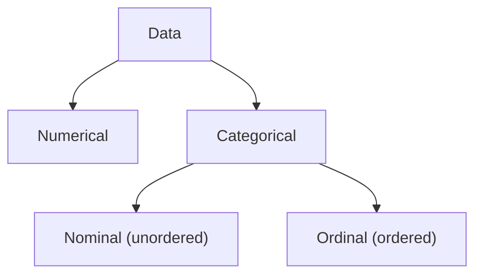
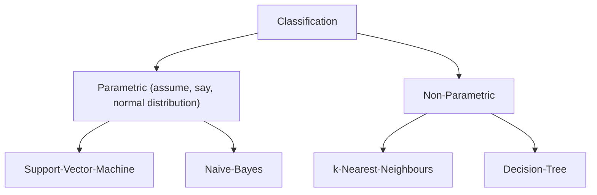
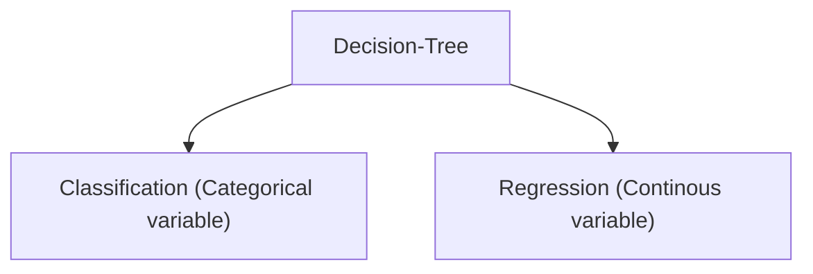

# Notes on Machine Learning
- Supervised - ML learns rel b/w input & label
- Unsupervised - ML learns rel b/w diff parts of input. One application is *clustering*
- Reinforcement - (involves multiple steps/predictions instead of single) ML takes a few steps, then humans rate it as better.

**ML models have no hidden layers**. They work best with *Independant & Identically Distributed (IID)* variables.

- In training loop, both hyperparameters and model weights are tuned.
- Train-Test-Validation split is typically 60:20:20.
   - Validation data is used after every epoch to see model tranining performance - 
      since it's used in every train epoch, it has some data leakage. 
      That's because even though our model didn't see validation data, the training system did - 
      it used validation data performance to tune hyperparameters.
   - Test data is used only after training is done.

*Wierdness of Higher Dimensions*: Higher Dimensions have many unintutitive properties, so it's best to rely on math instead of our intuition in these. For example, at high dimensions, volume of hyper-sphere approaches 0% of volume of smallest hyper-cube that fully occupies it.
  
- **Cross / Rotation Validation**: Used when we have very limited data, so can't afford to split seperate test data.
    - Train multiple models - in each, split train & validation data differently from the same data.
    - One technique for splitting train & validation data for each model is *k-Fold Cross Validation*.
      Divide data into k groups. Then generate N sets of train & validation data: validation has chunk no. i, train has rest.
    - Optional final step (assuming we watched out for overfitting in the previous models):
    Train final model with whole model. Its performance should be better than that of worst model (out of models previously trained)

### ML Mistakes to Avoid
- *Data Leakage / Contamination*: data is present in both training & test data.
- *Information Leakage*: validation data affects some aspect of training - eg. scale (for transformation) determined with data that includes validation data

### [Underfitting & Overfitting](https://www.kaggle.com/code/dansbecker/underfitting-and-overfitting)
*Underfitting* is easy to fix - just add more training data. Methods to fix *Overfitting*:
- While training, if validation error doesn't decrease for a few training epochs, *Early Stop training*.
- **Regularization** methods delay over-fitting to later epochs. A popular way is to limit the values of the parameters used by the classifier. By keeping all of the parameters to small numbers (i.e., all are roughly in the same range), we prevent any one of them from dominating. This makes it harder for the classifier to become dependent on specialized, narrow idiosyncrasies. Amount of regularization to apply is specified with a hyperparameter $\lambda$ - higher $\lambda$ means more regularization and smoother curves. **TODO:** What is formula for amount of regularization, and practically how does it affect regularization?

- *Bias* measures the tendency of a system to consistently learn the wrong things (underfitting)
- *Variance* measures its tendency to learn irrelevant details (overfitting).
- **Bias-Variance Tradeoff**: As bias reduces, variance tends to increase (& vice versa).
- Usually we want *low bias (simpler curves) & low variance (model can generalize well).*
  But there are some exceptions where we don't care about one of bias or variance:
    - If data is perfectly representative of future data, then we don't care about high variance 
    since we want the model to fit the data perfectly.
    - If data is not a good representative of future data, then we prefer low bias (so that model gives some reasonable answer on future data) don't care about variance (fitting the data isn't too important because it's lousy data).

**TODO:** Go through (& implement) example at: 
- book "Deep Learning - A Visual Approach" 
- chapter "Underfitting & Overfitting"
- my comment "Bayes Rule Example: Curve-Fitting"


## Data Manipulation
**Data Types:**


**Data Cleaning:**
- *Dealing with Missing Values*: One approach is to just drop the columns having missing values. But this is not recommended because the column could have important information. Instead a better approach is to fill in missing values with the column's average using [`sklearn.impute.SimpleImputer`](https://www.kaggle.com/code/alexisbcook/missing-values#Score-from-Approach-2-(Imputation)).
- [*Dealing with Categorical Data:*](https://www.kaggle.com/code/alexisbcook/categorical-variables) Categorical data are like Enums - they have one of a fixed set of values (eg. `male`, `female`, `other`). 
2 approaches:
   - Ordinal - convert to 1 numerical column having values like $0, 1, 2, ..$
   - One-Hot Encoding - convert to mutiple columns (one for each value in fixed set), each having value 1 or 0 to indicate whether the value is present or missing. It's *impractical on large no. of columns (>= 15)*. **It's usually slightly better than Ordinal encoding.**

**Data Slicing:**
- *Sample-wise*: All features are aspects of same thing. *Eg.* When data is audio amplitudes at different times, it makes sense to independantly normalize each audio sample (0 -> quitest, 1 -> loudest).
- *Feature-wise*: Features are independant (they represent fundamentally different things). *Eg.* Mean Subtraction $X - Avg(X)$
- *Element-wise*: All elems independant. *Eg.* Centimeters -> Millimeters conversion.

**Data Augmentation:** Enlarge a dataset - eg. in images, we can randomly flip, rotate, scale, shift horizontally/vertically, etc. After augmentation, *each column of data is usually standardized so that it has zero mean and unit variance.*

**Data Shrinking:** (to make training & inference faster)
- *Feature Selection / Filtering*: Discard useless or almost useless features (eg. correlated with a different feature already present in data). Impact of discarding each column in a dataset can be estimated in various ways - check [feature_selection.ipynb](feature_selection.ipynb) to see some of these.
- *Dimensionality Reduction*: Sometimes when multiple features are strongly related, we can replace them with a single feature that combines both. One way to do this is with **Principal Component Analysis** (explained below).

**Principal Component Analysis (PCA)**: Reduce dimensions of data
- Project N-dimensional points onto 1 or more lower-dimensional line/plane of maximum variances (i.e., which has the largest range of points after they are projected onto it). Each of these projection planes is called a *component* - basically a linear equation combining original features using some coefficients. *Principal Component* is the component with maximum variance.
- After PCA, check error with **Mean Squared Error (MSE)** and also check **Explainable Variance Ratio**. Interpret MSE like this:
    - MSE close to 0: Indicates very low error, almost perfect reconstruction (though this can sometimes indicate overfitting if the model is too complex).
    - MSE around the average variance of data: Can be considered reasonable, indicating that the model captures most of the variability in the data.
    - MSE significantly higher than the average variance: May suggest poor model performance or inadequate dimensionality reduction.
- **TODO:** Check the math of this (components are derived using *eigenvectors of covariance matrix*.)


### Data Transformation
- *Normalization*: Scale the data so that it fits in a range (usually $[0,1]$ or $[-1,1]$).
- *Standardization*: Transform data so that it has zero mean and unit variance.
    - *Mean Normalization / Subtraction*: Do $X - Avg(X)$ for each column, so that its mean becomes 0.
    - *Variance Normalization*: Scale it so that its Standard Deviation becomes 1 (so 68% data is in $[-1,1]$).
    - The result of standardization is called **Z Score / Standardized Value**:
    $$z = \frac{height - \bar{x}}{s}$$ 
    where $\bar{x}$ is the Mean, $s$ is the Standard Deviation.

**IMPORTANT**: After doing these operations on training data, *exact same operations should be done on test data*. Scaling factor, addition factor, etc. should be exactly the same in test data as determined in training data.

- *Univariate Transformation*: Applied independantly to each feature/column.
- *Multivariate Transformation*: Applied to all or some columns as a group (eg. scaling all columns by same factor).

Which type of transformation should be done depends on the problem. 
When X,Y are independant features, Univariate Transformation makes sense.

**TODO:** Check in detail when to do Multivariate Transformation.

**Inverse Transformation:** All ML libs have a way to invert transformation. For example:
```python
from sklearn import preprocessing
scaler = preprocessing.StandardScaler().fit(X_train)  # X_train is a Numpy array
X_scaled = scaler.transform(X_train)
scaler.inverse_transform(X_train)
```


## Problem Types

### Regression
Predict a numerical value - *eg.* predict house price (say $100,000). Models are evaluated using **Mean Absolute Error**. Basic statistics of regression is covered in [these notes](../StanfordStatistics/README.md#regression).

*Eg.* [This Kaggle code](https://www.kaggle.com/code/dansbecker/model-validation) shows how to do regression using `sklearn.tree.DecisionTreeRegressor`.

### Classification


Supervised ML | Pros                                | Cons                                           |
------------- | ----------------------------------- | ---------------------------------------------- |
kNN           | Flexible, Fast Train                | Slow Inference, High Memory                    |
Decision Tree | Explainable, Fast Train & Inference | Tend to Overfit                                |
SVM           | Fast Inference, Low Memory          | Train $Time \propto Size$, sensitive to $C$    |
Naive Bayes   | Explainable, Fast Train & Inference, No params to tune | Assumes Normal Distribution |

#### Discrete Classification
When we can split things up this nicely, we call the sections into which we chop up the plane *decision regions / domains*, and the lines or curves between them *decision boundaries*.

Multi-class classification using **Boundary Classification** ML methods:
- One vs Rest / Binary Relevance: multiple binary classifiers, one for each class (eg. A | ~A). 
For any input, inference on all; ans = one where predicted with max probability.
- One vs One: multiple binary classifiers, one for each combination of classes. Each classifier votes, label with max votes wins.
- **TODO:** Check/Implement practical examples of this.

**K-Means Clustering**: *Unsupervised ML* model: cluster using averages of groups of points
- k (hyperparameter) = no. of clusters - model assigns a class to each of the k clusters found by it.
- *Curse of Dimensionality:* Past a certain point, adding more dimensions (features) can make it harder for ML to accurately classify.
That is, it's hard for the model to create clusters of points that *generalize*
Reducing k (no. of clusters/bins) helps, but after enough dimensions the situation isn't improved (i.e., density -> 0)
- *Blessing of Non-Uniformity / Structure:* Most real-world data doesn't tend to uniformly spread: a few regions will be dense, most spaces will be empty. So having good enough density at the dense regions is sufficient.
- This is why, if an ML system has lots of features, we will *need a large amount of training data* to accurately classify.

**k-Nearest Neighbours (kNN)**: Supervised, Non-Parametric ML: For any test point, find k nearest neighbouring points - the most popular class among these is predicted. 
- It's an *on-demand / lazy* algo because training data isn't processed at all, i.e., there's no learning step - the training data is simply stored. *With larger k, prediction boundaries smoothen*.
- Pros: Can handle any kind of boundaries / distribution of classes. 
- Cons: **Inference is slow and it consumes a lot of memory** because all the training data is in memory at inference time. Also to classify accurately, the k neighbours actually need to be near, so it **requires a lot of training data**.

#### Probabilistic Classification
- Predict the probability of output classes. For example, [this (unsolved) problem](https://www.kaggle.com/competitions/playground-series-s4e1/overview) asks us to predict probability (b/w 0 to 1) of whether a customer continues his account with the bank or closes it. 
- Models are evaluated using [Area under ROC Curve](https://en.wikipedia.org/wiki/Receiver_operating_characteristic), which plots True Positive Rate against False Positive Rate at each probability threshold.
- **TODO:** Check this in detail.


## Machine Learning Models

### Decision Tree
Decision Tree is a supervised, non-parameteric ML model that uses binary trees.

**Types:**


**Training** is *greedy*: at a time, only the tree trained so far and a single sample is considered - the whole training data isn't considered at the start to balance the tree. At each leaf node, if current sample is same as all classes in existing data at the leaf node, then it's added to the leaf. Otherwise a new branch is created for the new sample. When we reach depth limit, then branching isn't possible.

A leaf node is *pure* if all data in it is of the same class - purity is reduced when data of any other class is added. When purity falls below a threshold, the node becomes *impure* and is split.

**Node Splitting methods:**
- *Information Gain (IG)*: $IG \propto 1/Entropy \propto 1/Purity$: Choose test such that sum of children's entropies/purities is less than parent's entropy.
- *Gini Impurity*: Minimizes probability of mis-classifying a sample. **TODO:** Check how its math works.

Decision Trees are very prone to overfitting - some strategies to limit overfitting are:
- Depth Limiting
- Minimum no. of samples required for each leaf node
- *Pruning*: Starting at bottom, trim each leaf node if error rate is acceptable after removing it. If all children of a parent node have been removed, then it becomes a leaf node which is eligible for trimming.

### Support Vector Machine (SVM)
SVM is a supervised ML model that finds the boundary line furthest from each cluster of points (each cluster of a different class). First algo chooses points called *support vectors*, then chooses a line farthest from these - distance from line to support vectors is called *margin*.

**Hyperparameter C** controls how sensitive SVM is to points appearing in the margin zone. The lower C is, the more SVM wants an empty margin zone; for higher C, it allows more points to appear in the margin zone.

SVM is parametric since it expects classes to be seperated by linear boundaries. But it can still work with data seperated by non-linear boundaries using **SVM Kernel Trick**, a mathematical technique using which the data is transformed to higher dimensions such that now a linear boundary can be drawn. ML libraries automatically apply this method.

### Naive Bayes
It's a *very fast* parametric method in which we assume points of each class are in a normal/gaussian distribution, and we find the parameters for each class's normal distribution during training. During inference, we find the probability of a sample point being in normal distribution of each class - class with maximum probability wins.

### Ensemble
Instead of a single model, *Ensemble* is a group of similar models. Each model is trained on slightly different data, which makes it unlikely that all of them will make the same mistake. Final decision is done by voting.

Voting Types:
- **Most Commonly Used**: *Plurality Voting* is when each model gets a single vote, majority vote wins.
- *Weighted Plurality Voting*: Each model's vote gets a different weight. One variant is to use model's prediction confidence as weight.

#### Ensemble of Decision Trees
*Bagging / Bootstrap Aggregating*: Create N [bootstrap](#bootstrapping) samples. Then train a decision tree of depth D on each sample. Inference is done using Plurality Voting (no weights, every model gets single vote).
- *Law of Diminishing Returns in Ensemble Construction*: After a certain point, adding more models doesn't improve results. A rule of thumb is to **use about same no. of classifiers as no. of classes**.

Randomization Techniques:
- **Random Forests**: While training, before branching in the decision trees, do *feature bagging*: choose a random subset of features and then find best test based on these only. Purpose is to minimize chance of making same decision in every tree at the node. 
*Hyper-Parameters:* No. of trees, Depth of each tree, % of features to be considered at each node.
- *Extremely Random Trees / Extra Trees*: At each branching of trees, choose split at random (instead of choosing best split). This *trades off some accuracy for reduced overfitting.*

#### Boosting
Combine multiple weak learners using *Weighted Plurality Voting* - i.e., vote of each model is added after weighting (rather than directly). The weights are chosen by a **Boosting Algorithm**. A good rule of thumb is to use about as many models as the no. of classes.

A *weak learner* is a model whose accuracy is at least slightly better or worse than chance. Eg. *Decision Stump* (Decision Tree with a single branching node, such as $x > 5$). **Only requirement is: learner accuracy != chance**

For Binary Classification, *AdaBoost* boosting algo is used. One way to do multi-class classification is **Gradient Boosting** algorithms with **XGBoost** (`multi:softprob` gives probability distribution over all classes) and **LightGBM** `multiclass`. They work by extending Binary Classification loss function to Multi-Classification loss, eg. with **Softmax**.

NOTE: Boosting with Decision Stumps and Softmax loss function is **equivalent to one layer of a Deep Learning Neural Network**.


## Performance Metrics
- Type I Error = False Positive (FP)
- Type II Error = False Negative (FN)

Actual \ Predicted | Positive | Negative |
------------------ | -------- | -------- |
True               | TP       | TN       |
False              | FP       | FN       |

- Precision (Positive Predictive Value) = TP / (TP+FP)
- Recall / Sensitiivity / Hit Rate / True Positive Rate = TP / (TP+FN)
**Precision-Recall Tradeoff**: As one goes up, other goes down

- Specificity = True Negative Rate = TN / (TN+FP)
- **F1 Score**: combines both precision and recall. when F1 score -> 1, that means both Precision, Recall -> 1

$$F1 = \frac{2 \times TP}{2 \times TP + FP + FN} = \frac{2 \times Precision \times Recall}{Precision + Recall}$$
   
- **Matthews Correlation Coefficient**: gives an idea of how many values lie on the True Positive diagonal
   - *Range*: 1 -> perfect prediction, 0 -> random predictions, -1 -> exactly opposite predictions
   - Python: `sklearn.metrics.matthews_corrcoeff`

$$MCC = \frac{TP \times TN - FP \times FN}{\sqrt{(TP + FP)(TP + FN)(TN + FP)(TN + FN)}}$$

While drawing confusion matrix, prior info should be taken into account.
*Eg.* if we know in advance that only 1% of population has disease, we should draw confusion matrix taking that into account. In this example, test has 99% accuracy - but Precision is only 33%, i.e., out of all predicted with disease, 67% are false positives!
  

## Statistics
- Probability Mass Function is just another name for Discrete Probability Distribution
- **Uniform Distribution:** All values equally likely.
- In a **Normal / Gauss Distribution / Bell Curve**:
   - Mean = Median = Mode
   - low standard deviation means narrow bump of bell curve
   - *Three-Sigma Rule in a normal distribution*:
      - 1 std. dev. (area around both sides of mean) = 68% of total curve area
      - 2 std. dev. = 95%
      - 3 std. dev. = 99.7%
- Bernoulli Distribution (discrete) - only 0,1 are possible values. Eg. probability of head/tail on tossing a coin
- Multinoulli / Categorical Distribution (discrete) - one of more than 2 possible values.
- Covariance (C): $dy \approx C \times dx$ (one var is approx fixed multiple of each other).
    - Correlation (b/w -1 and 1) is better because it's independant of scale, units - 
      we can compare whether one set of vars is more strongly correlated than another.
    - *Partial Correlation* = multi vars, we are only checking correlation between 2 of the vars

### Bootstrapping 
- estimate mean of large population
- init sample = Sample Without Replacement (SWOR)
- Resample from init sample using Sample With Replacement (SWR) - each of these new samples are called Bootstraps
- Draw distribution of mean of Bootstraps
- Now from this distribution (it's an approx bell curve of actual population), 
we can say for example that p% of population is b/w x1 and x2 - this is called a *Confidence Interval*.
- Even with a large population (eg. millions), we can make small bootstrap samples of only 10-20 vals each.We can gen. thousands of such bootstraps - the more we generate, the more the curve approaches Normal Distribution & becomes more accurate
  
### Bayes Posterior-Prior Loop
Bayes Rule (Conditional Probability) loop - each experiment gives us a better value of $P(A)$:
- Known: *likelihood* $P(A|B)$, *evidence* $P(B)$
- let $P(A) = p$   (initial guess of its probability)
- repeat N times:
    - peform experiment, observe what happens (outcome = $B$ or $\neg B$)
    - *Bayes Rule:* $P(B|A) = \frac{P(B) \times P(A|B)}{P(A)}$   (old $P(A)$ is the *prior*)
    - now update $P(A) = P(B|A)$ since we know B happened (or $P(\neg B|A)$ if B didn't happen) - new $P(A)$ is the *posterior*.


## Information Theory
**Variable-bitrate code / Adaptive code** - chars have variable-length encodings, optimized so that more frequent chars are shorter.
- *Eg.* Morse Code
- *Compression Ratio* (0 to 1): No. of bits req in Adaptive Code / No. of bits req in Fixed-Length code ; 
1 means no savings, lower the ratio, higher the savings from using Adaptive Code. **TODO:** Check if this formula is strictly accurate.

**Entropy:** min no. of bits required to send a message, using an encoding scheme perfectly tuned to that message. **TODO:** Check Entropy range, formula (is it actually equal to min bits or is it proportional to it?)
- *Cross Entropy* (way to compare 2 probability distributions): tells us how many more bits we need if using some other, less perfect, encoding. If 2 probability distributions are identical, their Cross Entropy is 0.
Cross Entropy is assymetrical - cross entropy of A wrt B != cross entropy of B wrt a.
- *Binary Cross Entropy* is a special case when 2 chars in alphabet.
(i.e., binary classification problem, where we're calculating cross entropy of a Probability Distribution Function (PDF) of model prediction wrt PDF of actual labels.)
- Higher cross entropy means higher error
- *Relative Entropy* = extra no. of bits req using imperfect code $Entropy - CrossEntropy$. **TODO:** Cross vs Relative Entropy ; calc Entropy, Cross Entropy, Rel. Entropy in an example
- KL Divergence is similar to Cross Entropy (tells us how much error). But Cross Entropy is faster to calculate, so that one is used in practice.
