# Neural Network Architectures
Basic feed-forward networks were [previously discussed](DeepLearning_NOTES.md). Now different architectures of Neural Networks will be discussed.

Ways to specialize a pre-trained base model trained on a generic database:
- **Transfer Learning**: Freeze existing layer weights, add a few hidden layers at the end of base model's hidden layers and only train these. Existing output layer is usually replaced with a new one.
- **Fine Tuning**: All layers' weights are modified - no frozen layers. *Generally used when specialized task is significantly different from general task*. If we don't want to retrain, we can train a second *downstream model* that converts base model's output into specialized output.

Transfer Learning vs Downstream Models : In transfer learning, base model's output layer is discarded. Whereas while training downstream models, output of base model is used as input (which includes base model's output layer).

### Image Processing
Image Tensors' dimensions depend on the no. of channels:
- Grayscale - 1D (each pixel has only one colour value)
- Coloured  - 3D (each pixel has RGB colour values)

Each image is a sample, and each image pixel is a feature.

**Sliding vs Rolling Windows**: Sliding (overlapping window), Rolling (non-overlapping window)

### Natural Language Processing (NLP)
NLP Tasks:
- *Sentiment Analysis*: classify text as positive / negative
- *Translation*
- *Answer Questions* based on text, like who is the hero, what actions occurred, etc.
- *Summarize / Paraphrase*
- **Natural Language Generation (NLG)** - gen text that follows *prompt*. A popular technique is **Autoregression** in which one word is generated following prompt, then it's appended to prompt and then next word generated, and so on.
- *Logical Flow*: Sentence S1 asserts a premise, sentence S2 asserts condition based on premise. Verify if S2 logically follows from S1. **It's difficult, generally requires human help.**

A *Language Model* takes a sequence of words as input and tells us probability of it being a well-formed sentence. 

2 approaches:
- Character-based
- Word-based approach - used most of the time - each word is converted to a number, where the *vocabalary* has the list of all words and their corresponding indices / numbers.

## Convolutional Neural Networks (CNN)
Deep Learning Models in which Convolutional Layers play a significant role. *All-Convolution Networks* have all layers as only convolutional layers.

**Applications:** Very successful in images (classification, modification, generation), also used in other domains like NLP (understanding sentence structure, sentence classification).

We can make a neuron *filter* to detect yellow (one value to detect yellowness from 3 initial RGB values): $ReLU(R+G-B)$ and then *sweep* it over all image pixels. *Sweeping* corresponds to **convolution** matrix operation. To make this faster, we can make a huge grid of neurons, each with identical weights, and apply it at once to the image - this is called *weight sharing*.

Convolution of input matrix $A$ with kernel matrix $B$ involves flipping kernel and sliding it over input, calculating sum of element-wise product (where both matrices are of size $M \times N$):

$$C(i, j) = \sum_{m=0}^{M-1} \sum_{n=0}^{N-1} A(i+m, j+n) \cdot B(m, n)$$

We can also sweep over the image with a *spatial filter*, where several pixels centered over an *anchor* points are processed at once by a single neuron. Its *footprint / local receptive field* is the shape of the input pixels passed to a single neuron - eg. we can process a pixel and its 8 neighbours at once (3x3 square shape) - so the neuron has 9 input features (assuming grayscale image). Usually small square $side \in [1,9]$ with odd size is used.

*Feature* (NOT the same as before, where it simply meant columns) also refers to a particular type of structure that a neuron is looking for (eg. zebra stripe). So the filters are also called *feature detectors*, and their output *feature map* tells us (for each pixel) how well image around that pixel matched feature we're looking for. Applying one filter, then another filter on outputs of first filter, and so on, allows us to detect very complex features.

Around the border of the image, we add *Padding* - extra elements, usually 0, so that spatial filter can get values at corners also. Thickness of border padding depends on size of filter.

For RGB images (3 channels), spatial filter and footprint both have 3xNxN size (where N is side of square). *Every filter must have same no. of channels as the image it's filtering*.

*Convolution Layer*: applies many filter neurons simultaneously & independantly on the image. Usually same padding is used in all the filters of a layer. Its output tensor will have as many channels as filters in the layer.

*Initial (Random) Weights* are usually chosen automatically by library. Best algos are by He, Glorot.

**1D Convolution**: special case where filter moves only in one direction, width or height. Eg. NLP - grid where rows are words (each cell is a letter), and spatial filter of size same as width is swept only in vertical direction.

**1x1 Convolution** (feature/channel reduction): a layer can have many similar filters that can be combined. Eg. a layer has 300 filters, then next layer has all its filters 1x1 (i.e., sweeping through exactly one cell at a time), and reduce no. of layers to 175 - result is that 300 channels in first layer get compressed to 175 channels in next layer. Note that both layers have same width, height. Particularly effective if channels of input layer are correlated.

**Pooling / Downsampling** (reduce width, height): blur image (or output tensor of previous layer) by aggregating each rolling window into single value. Pooling allows our convolutions to be *shift invariant* (i.e., tolerate some error due to some parts of feature being slightly out of alignment)
- Average Pooling: *box / low-pass filter* averages cells in window using a kernel matrix having all 1s.
- **Preferred** Max Pooling: learns a lot quicker than average pooling
- *Striding*: combines pooling with layer output to make it faster. During layer inference, convolution filter of NxN size and step size > 1 is used. Most common is filter size = step size, which means non-overlapping windows.

**Upsampling** (increase width, height, keeping channels constant)
- *Transposed Convolution / Fractional Striding*: combines convolution & upsampling: add extra empty row & column (filled with zeros) in between each original element, then surround with ring of zeros as before and then do convolution.

NOTE: Striding gives different (but similar) output than convolution, followed by pooling. A network trained with convolution + pooling layer can't just be replaced with a striding layer (and vice versa). Similarly for Upsampling and Transposed Convolution.

**CNN Best Practices**:
- Choose small filter sizes - eg. 2x2, 3x3, 5x5
- Start with 2-3 Convolutional Layers - if model underfits (not learning enough), then increase layers.
- Use Max Pooling after 1-2 Convolutional Layers to reduce dimensionality - 2x2 pooling with stride 2 is a popular choice.
- Dense (fully connected) layers are optionally placed at the end of the network.

**CNN Applications besides Images**:
CNNs can also be used for non-image applications. CNNs are useful wherever there's a spatial relation between inputs. Here, "spatial" simply means continous - time series could also be used as input. 1D convolution with temporal data can be used - note that 1D convolution should be used instead of 2D is because inputs only have inherent ordering in one dimension (time) - see details [here](https://stats.stackexchange.com/a/550774/406211).

### Real-Life CNN Examples
- Convolution Network for classifying handwritten gray-scale digits (MNIST dataset of 60,000 images):

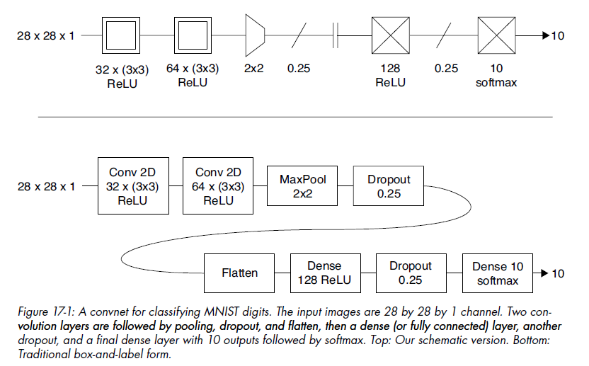

**NOTE:** In the convolution layers, 32 x (3x3) means 32 filter neurons, each having (3x3) footprint. Stride is not mentioned, that means default stride 1 is used.

Though only 2 convolution layers (represented as boxes with double borders) are used at start for feature detection, this is still a CNN since they do heavylifting. 2 fully-connected/dense (i.e., traditional non-convolutional layers) are used at the end (represented as boxes with crosses), with support layers (pooling, dropout, etc.). Since no padding is applied, convolutional output width, height are smaller than input (border pixels don't show in output) - this is ok in this case since most images in the dataset have 4 extra border pixels.

Here a *flatten* layer converts N-dimensional convolution output tensor into a 1D vector that can be input to dense/fully-connected layers.

We know we haven't overfit because training & validation accuracy curves don't diverge, despite 99% accuracy.

- VGG16: CNN with 16 layers for classifying photos from ImageNet dataset:

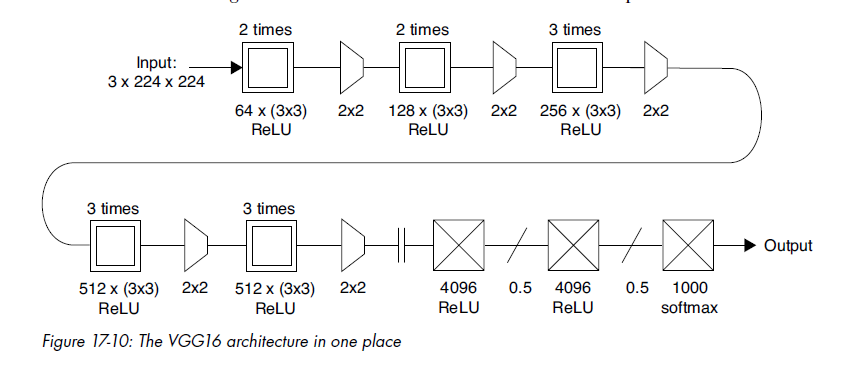

### Visualizing CNN Filters (neurons)
We can visualize what patterns an individual filter (CNN layer neuron) is detecting by finding images that maximizes filter's outputs.
Only considering the Convolutional layers:
- feed in random numbers initially for the image - in feature map for the filter, use filter's output's sum as replacement for error.
- Like backprop, compute gradients using this error, going back to first Convolutional layer. But DON'T adjust weights, instead adjust input values in the direction of *maximum error* using gradients of first convolutional layer. (Max error to stimulate the neuron as much as possible).

Another (easier for me!) method is to simply take a sample input image, and look at the output image for a single filter.

### Adverserial Inputs
VGG is quite accurate, but we can still make small changes input image's pixel values that aren't noticeable to human eye, but completely mess up CNN output. Such images are called *adversaries*, and change made to input image is called *adverserial preturbation*. Sometimes we find preturbations that mess up model output for any image, these are called **universal preturbation**.

## Autoencoder Architecture
Learns how best to encode a type of data. Mainly used for cleaning noise (eg. denoising grainy images), and for reducing dimensionality. Decoder (2nd half on autoencoder) can be used as a **Generator** that creates new data that looks like the training data. Note that it doesn't always compress input data into fewer latent variables - in Denoising, latent variables can be actually more than input variables!

**Blending**:
- Content Blending: add/superimpose x% of image1 and y% of image2
- Parametric / Representation Blending / *Interpolation*: For 2 images, find their latent vars, calc intermediate latent point and then decode it - resultant blended image conceptually represents half of both images.

Autoencoders allow us to blend compressed versions together, and (to a degree) recover the blended uncompressed data.

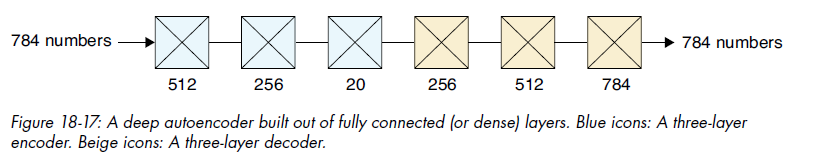

Here the initial dense layers encode N input variables into 20 *latent variables*. Then the dense layers after that decode 20 compressed variables back into N output vars. The narrow area in between encoder and decoder is called *bottleneck*, and last encoding layer (just before bottleneck) is called *bottleneck layer*. The space of all latent variables is called *Latent Space*. Like in this example, we often build encoding layers that decrease no. of vars by 2 times (512 -> 256), and corresponding increase in vars in decoding layers. 

Autoencoder is **semi-supervised learning** because we give an explicit goal (output should equal input) but there aren't any manually determined classes / target variables associated with each input.

The structure of Latent Space isn't immediately apparent, however we can see that there is structure by decoding nearby points in latent space - the system tends to cluster together similar images.

### Convolutional Autoencoders

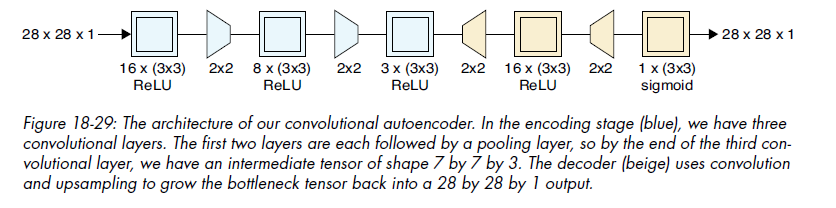

Here pooling is used between convolutional layers to reduce image width, height in encoder. Upsampling is used in decoder to increase image width, height to original. This performs quite better (i.e., decodes latent variables better).

*Denoising Autoencoder*: Removing noise from image. Note that in below example, input of shape 28x28x1 (784 nums) is encoded into latent variables of shape 7x7x32 (1568 nums) which is about double of nums in original input! But this is ok in this case since we aren't concerened with compressing. Also note that pooling and upsampling layers have been combined with convolution here, which reduced one-third of training time.

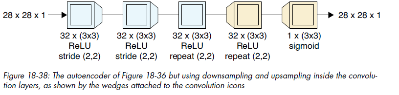

### Variational Autoencoders (VAE)
They have some degrees of randomness and are non-deterministic - for same input, latent vars output each time are slightly different.

1. All Latent variables should be gathered into one region of latent space, so we know range for random values.
2. Latent vars of similar inputs should be close together.
3. Minimize empty regions in latent space.

For point 1 (all latent vars in bounded space), add a constraint to error function that each latent var should approximately form unit gaussian (most points close to 0). 

*Reparametrization Trick*: From each latent variable from encoder, calculate 2 nums: center (mean), and standard deviation (spread). Then pick a random number from a Gaussian distribution with this mean and std-dev. The resultant number is usually very close to center. The new numbers are now used as Latent Variables by decoder - it gives a big error if new image is far from original image. System learns what should be center, spread for each latent variable's gaussian distribution.

The final loss/error function will also check the similarity between weights of encoder and decoder layers. It's done using **Kullback-Leibler (KL) Divergence**, which measures error from encoding information using encoder different from optimal encoder. Here we're asserting that optimal decoder is opposite of optimial encoder.

Eg. The below is based on MLP autoencoder from *Caffe* library (MLP = Multi-Layer Perceptron means fully connected neural network). It has 50 latent variables:

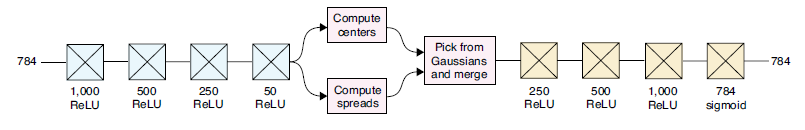

## Recurrent Neural Networks (RNN)
RNN remembers something about each sample before processing next sample. It's also used for generating new sequences. *Recurrent* means that it uses the hidden state for each input.

- *Sequence* has multiple test samples whose order matters (eg. words in sentence, image frames in video). Each sample in the sequence is called a *token*.

NLP issues (using normal fully-connected networks):
- *Semantics* (structure of language) is fundamentally different from mathematical curves.
- Even a tiny error in prediction gives incomprehensible text (since one word to the next can be completely different).
- Word order is not preserved.

In NLP, it represents words as simple numbers - first word encountered in text is given number 0, next 1, etc. If a word that's already known is encountered, it's skipped. The *vocabalary* contains all words and their corresponding num

RNN keeps a *hidden state* - output is a function of both input and this hidden state. Each successive input (called a *time step*) updates state - order of inputs matters.

This is the *rolled-up* diagram of a *recurrent cell*, where the *delay* (little black box) represents its hidden state. Its *unrolled* diagram is like a state machine diagram that shows all states and inputs causing state transitions explicitly. The exported state of the layer is usually shown with a dotted line to show that it's available if needed, but can be ignored if not required. 

**A recurrent cell contains one or more neural networks within it.** A recurrent cell is often placed in its own layer, called a *Recurrent Layer*. A network dominated by recurrent layers is called a *Recurrent Neural Network (RNN)*.

Internal state of a recurrent cell is represented by a tensor with a *width* and *height*. If cells in RNN network have same width, it's called *network width*.

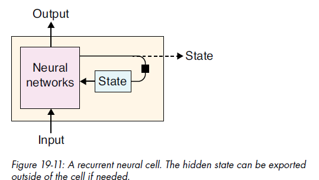

The unrolled diagram of a recurrent cell is shown like this:

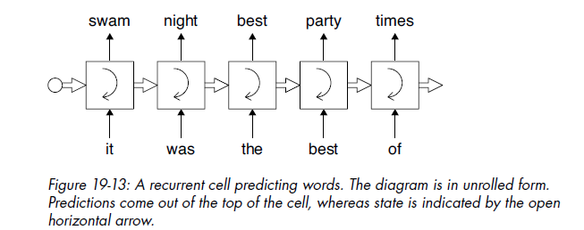

During training, gradient error needs to be propogated backwards sequentially from last cell to first. But that's not possible because they are all same cell! This is solved using technique **Backpropogation Through Time (BPTT)**. 

During backprop, suppose we find that gradient of a weight is smaller in previous layer. Then this process will keep on repeating for each previous layer and make the gradient for that weight exponentially smaller. But that means learning will slow down or even stop (due to gradient close to 0)! This is called **Vanishing Gradient** problem. Its inverse is called **Exploding Gradient** problem where the gradient increases exponentially during backprop.

### Long Short-Term Memory (LSTM)
These gradient issues can be solved with solved with a better recurrent cell, where the internal state changes frequently (short-term) but some portion of information is kept in state for a long time.

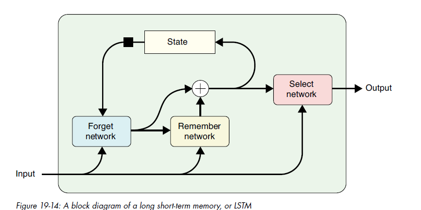

**LSTM contains 3 internal neural networks**:
- one to "forget" (discard) state that's no longer needed (means move number representing that state to 0)
- one to "remember" (add new info) to state (means adding new number to the state tensor at appropriate location)
- one to "select" a version of the state as output

LSTM doesn't require repeated copies of itself, so it solves the gradient problems of the basic recurrent cell. Neural networks inside it are trained normally using backprop and optimization.

When we say RNN, LSTM cell is implied. *Gated Recurrent Unit (GRU)* (a popular variant of LSTM) can also be used.

**Tradeoff in training RNN** is that we can use larger networks (with either large no. of cells, or cells with larger state memory) for better predictions, but that will take more time and memory.

### RNN Architectures
- **CNN-LSTM**: Useful for things like classifying video frames - convolutional layers find & identify objects, while recurrent layers track how the objects move from one layer to next. Note that LSTM is required for tracking objects to deal with cases that normal code can't handle easily - object disappearing & reappearing later, object following non-linear motion (eg. spinning), objects changing appearance, multiple object interactions, accurately work with noisy data, etc.

- **Deep RNN**: Multiple RNN cells stacked on top of each other.

### Translation with RNN
- **bi-Directional RNN (bi-RNN)**: Used for translating text, so that we can use context from both previous and later words. Here we have 2 RNNs - one that tracks state from start of sentence, one from end. Inputs are given to both RNNs and then their outputs for each word are joined/concat together.

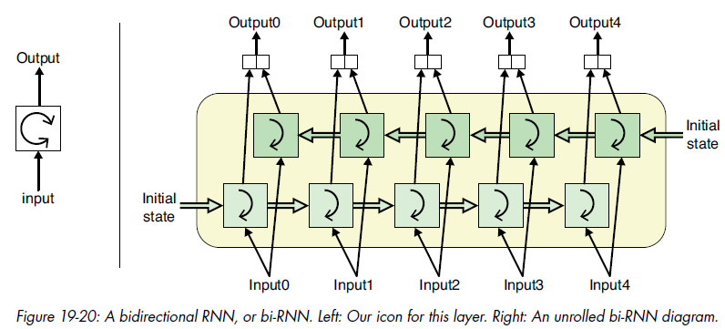

*Deep bi-RNN* has multiple layers of bi-Directional RNNs.

- **Seq2Seq**: Word-wise translation of text is problematic because sentences in different languages can have different lengths (no. of words) and word order (eg. noun before or after verb). Seq2Seq architecture translates input sequence to output sequence (possibly of different length) as a whole.

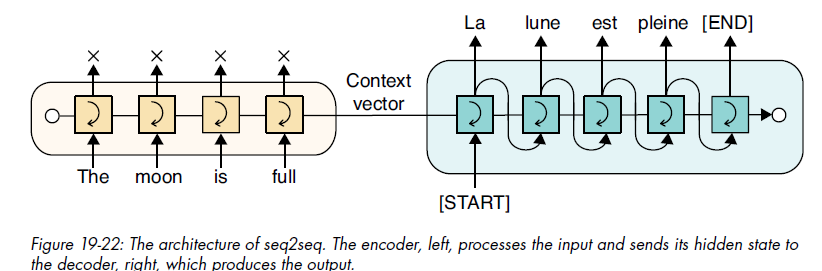

2 RNNs are used - encoder and decoder. Encoder RNN's word outputs are ignored - instead its final state is passed to decoder RNN. Decoder RNN uses this as its initial state and produces words using autoregression. *Context Vector* is the final state of the encoder RNN which is passed to decoder.

Decoder RNN gets a special start token as first input: `[START]`. It stops generating with autoregression when it produces special end token `[END]`.

*Long-Term Dependency Problem*: Seq2Seq performs well with smaller sentences but breaks down for larger ones. This is because Context Vector (only thing passed from encoder to decoder) has to decode all information in the sentence, but it's of fixed size - no matter how large we make the Context Vector, we can always make a larger sentence that it can't represent.

### RNN Limitations
- Processes one word at a time only.
- Fixed-size context vector has to encode all sequence info - breaks down for larger sequences.

## Attention Networks and Transformers

### Attention

#### Applications
- NLP: translation, LLM generation, etc.
- images: add attention to CNN network by scaling filter outputs to emphasize values produced in response to most relevant locations in input.

#### Word / Token Embeddings
In RNN words are represented as words, but we can instead encode them as vectors. *Embedder* algorithms create these *Word/Token Embeddings*. It's also possible to encode sentences instead of words, but word embeddings are more common.

Word Embedding vectors are encoded such that words with similar meanings have vectors near each other. So now we can tolerate some imprecision in predicted word embedding. Embedding vector similarity can be done with cosine similarity.

Pretrained Word Embedder algos: GLoVE, word2vec, fastText

**ELMo (Embedding from Language Models)**: Contextualized Word Embeddings
- ELMo has 2 layers of forward and backward bi-RNNs, grouped by direction. Layer 1 of forward bi-RNN feeds Layer 2 of forward bi-RNN, and similarly for backward bi-RNN layers, before finally concatenating outputs of both forward & backwards. OTOH in Deep bi-RNNs, layer 1 outputs of forward and backward are concatenated, then fed to next layer.
- Each input word is turned into 2 word tensors - from forward and backward networks, that are then concatenated to form final word embeddings which have context of both previous and next words. 

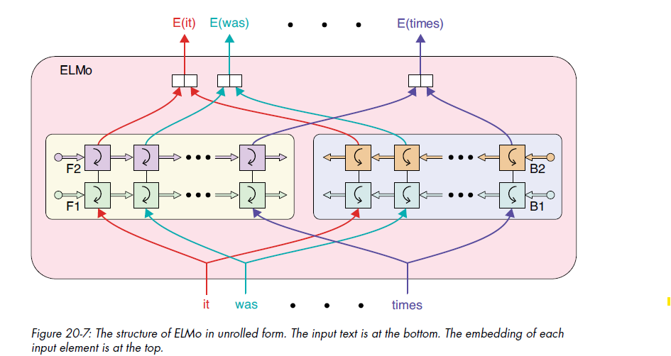

ELMo, and similar algos like *Universal Language Model Fine-Tuning (ULMFit)*, are typically trained on general-purpose databases. When we need them for specific downstream tasks (eg. legal, medical, etc.), they are fine-tuned with additional examples of that domain.

#### Self-Attention - Query Kev Value (QKV) mechanism
Calculating word embeddings of a single word (called *Query*):
- Find $Q$ tensor for Query word.
- For a given word that we're comparing Query against:
    - Find 2 tensors: Key $K$, Value $V$
    - Using dot product, calc tensor $RawAttentionScore = \frac{Q \cdot K^T}{\sqrt{d_k}}$ where $d_k$ is the no. of dimensions in Key Tensor $K$.
    - Calc tensor AttentionWeight to compare how well Query matches Key: $softmax(rawAttentionScore)$. 
      **We can view each element in resultant tensor after softmax as relevance $\in [0,1]$ of the corresponding element in Value tensor to our Query word.**
    - Now scale Value tensor with this weight: $AttentionWeight \circ V$ where $\circ$ means multiplying the 2 tensors element-wise.
- Finally add results for each Key word: $\sum AttentionWeight \circ V$

So final formula is (final embedding after QKV for a single Query word):

$$\sum softmax(\frac{Q \cdot K^T}{\sqrt{d_k}}) \circ V$$

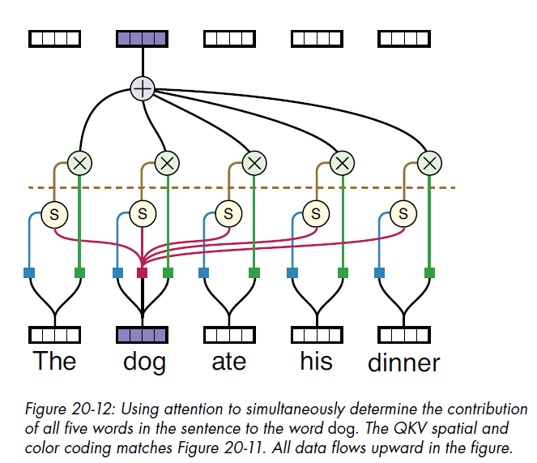

In above diagram, dashed line indicates division by $\sqrt{d_k}$ followed by softmax in attention weight.

**3 Neural Networks are required, one each for calculating Query, Key, Value tensors for each word.** Usually all 3 only have one fully-connected layer (no hidden layers). Each of them takes word embedding tensor as input (created by embedder models like word2vec) and outputs a tensor. Word embeddings are already in a space where similar words are close to one another - Query and Key networks fine-tune these so that they can be meaningfully compared for relevance. *Value network has to make values that can be usefully mixed (scaled and added).*

**Seperate networks for Query and Key allows asymmetric relationship - eg. for "it" word, "cat" can be relevant, but the reverse need not be true.**

*Softmax Saturation*: Suppose only $Q \cdot K^T$ was used in raw attention score. Then due to exponential nature of softmax, any large value would completely dominate (be close to 1) and everything else would be close to 0. If that happens, system can't learn. To prevent this, division by $\sqrt{d_k}$ is done before softmax.

A Query word is scored with every word in sentence, including itself. **Usually the word will score highest with itself - but sometimes it can score higher with a different word.** For example, the pronoun "it" can score highest with "cat" word if that is most relevant.

All words in sentence are processed parallelly (using them as Query word, and all words of sentence as Key words). Since none of the steps depend on how long the sentence is (i.e., they can all be done parallelly), **a long sentence can be processed in same time as short sentence** with only constraint being how much memory and computing power are available.

#### Q/KV Attention
Unlike self-attention (same words used for QKV), here one source of words is used for Queries and another for Key and Values. Often used to add attention to networks like *seq2seq* - queries come from encoder part of seq2seq, keys and values come from decoder part. That's why it's also called **encoder-decoder attention layer**.

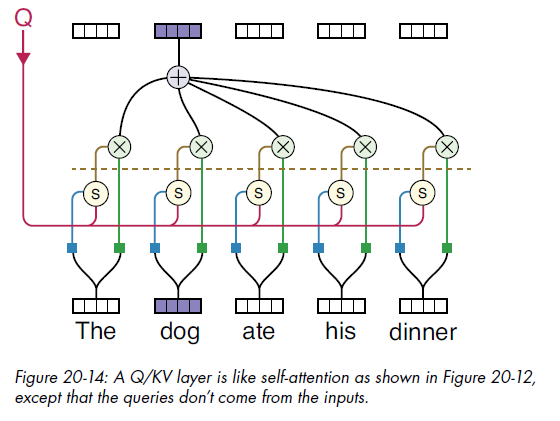

#### Multi-Head Attention
Multiple attention networks in parallel (on same input), each use a different criteria. Each attention network is called a *head*. Additional processing can be added to explicitly make each attention head focus on different criteria. **Both self-attention and Q/KV attention networks can be used in heads.** *Eg.* one attention head could be focusing on grouping all nouns, another grouping colours, another grouping by allitrics (word pronounciation) for poetry / music, etc.

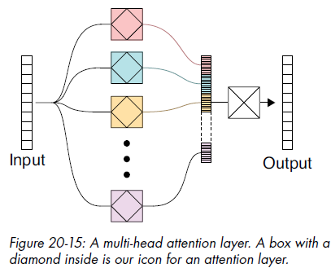

### Transformers
**Skip/Residual Connection** - add output of a layer (or multiple layers) back to the input. It enables the layer to focus on processing only a small part of the input tensor while the rest remains the same:

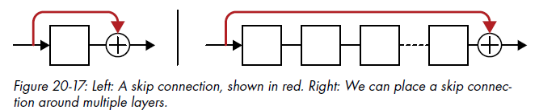

**Norm-Add** - first layer outputs are normalized (to form a Gaussian with mean 0, variance 1), then Skip Connection addition is done:

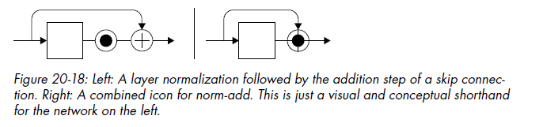

**Positional Embeddings** - first create positional embedding vector for each position/index of words in sentence. This positional embedding is added to the word embedding. A skip connection is used in every layer (except last) so that embedding (usually few bits at the end) are added back to output vector of layer.

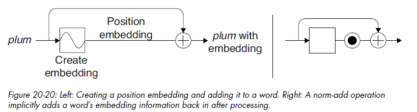

#### Transformer Architecture
Block diagram of a Transformer for translating sentence from one language to another:

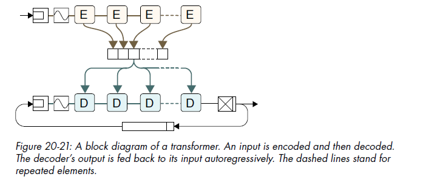

Decoder is a fully-connected layer (with softmax at end) that's autoregressive (output word is appended to list of outputs). It contains multi-head Q/KV attention networks - they recieve key and value vectors from encoder (this is why Q/KV attention is also called encoder-decoder attention).

NOTE: Initially word embedding and positional embedding is done before both encoders (processing source language) and decoders (processing translated language).

##### Encoder Block
First layer is multi-head self-attention (here 8 heads), so queries, keys and values are all derived from single set of inputs. It's surrounded by norm-add skip connection to keep an approximately Gaussian distribution of outputs as well as retain positional embeddings.

Next we have 2 1x1 convolution layers, collectively called **point-wise feed-forward layers**. They learn how to adjust output of multi-head attention to reduce redundancy and focus on info most useful to whatever processing comes next. First convolution has ReLU activation, second has none. These 2 are also surrounded by norm-add skip connection.

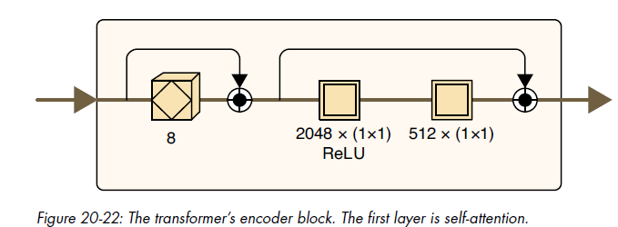

##### Decoder Block
In decoder, first we have multi-head self-attention that processes the transformer's output so far. At first when there's no output yet, the output contains a single `[START]` token. It's surrounded by norm-add skip connection. During training only, **masking** is added to this self-attention layer.

Next layer is Q/KV attention - it uses Queries from previous self-attention layer, and Key, Value tensors from concatenated outputs of all encoders. It's also surrounded by norm-add skip connection.

Finally we have 2 1x1 convolution layers, similar to encoder block.

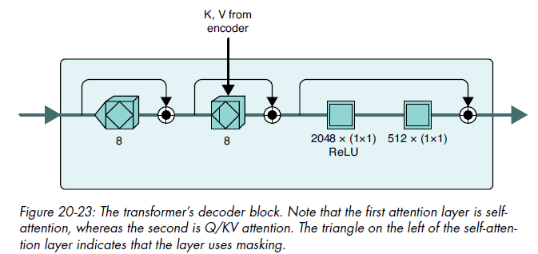

**Explantation of masking (used in first self-attention layer)**: During training, suppose we're expecting it to predict the sentence "My dog loves taking long walks". We predict all words in output in parallel, so we use masking to ensure each decoder sees only the previous words in sentence, NOT the word it's supposed to predict. So decoder for predicting first word will recieve no input, for second word will recieve "My", and so on. This is why this layer is also called **masked multi-head self-attention**.

### Transformers vs RNN
**Pros of Transformers**:
- They can be trained in parallel - it takes the same amount of time to work on a 500-word sentence as a 100-word sentence.
- Unlike RNNs, they don't need recurrent cells with finite internal states that can run out of memory, nor do they need multiple neural networks to learn how to control internal states of recurrent cells.

**Cons of Transformers**:
- Memory required by the attention layers grows dramatically by the size of the input. So for resource-constrained environments (eg. embedded), RNNs are preferred.

### BERT
BERT (Bidirectional Represtational Encoders for Transformers) is a general-purpose language model. It has a word embedder, then a position embedder, then transformer encoder blocks. Here a single line is shown inside the blocks but actually parallell operations are going on.

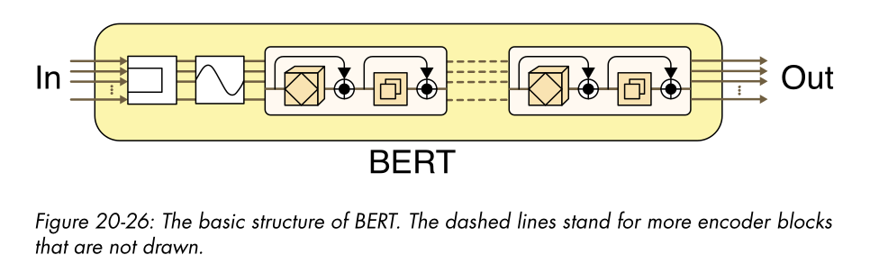

The original "large" BERT version was trained using 340 Million weights/parameters. It was trained on 2 tasks:
- *Next Sentence Prediction (NSP)*: Logical Reasoning: Give BERT 2 sentences (seperated by a special token) and ask whether second sentence logically follows from the first.
- *Cloze* task: Ask BERT to predict missing words in a sentence.

BERT extracts more info from input than RNNs. ElMo RNN is *shallowly bidirectional* because it has only 2 layers in each direction. OTOH BERT is *deeply dense* since it pays attention to all words simultaneously, so it doesn't have a notion of direction.

There are many BERT variants, trained on different tasks like:
- Checking if sentence is grammatical (classification problem) - using BERT, followed by a simple classification problem.
- Sentiment Analysis: sentence is positive / negative using *DistilBERT*

**DistilBERT** is a BERT variant - the term "distilling" is commonly used when we want to make a model smaller and faster without losing too much accuracy/performance.

**BERT uses only Transformer encoders, not decoders, so generation is very hard with it**.

### GPT-2
*GPT-2 (Generative Pre-Training Model 2)* is used for text generation. It only uses a sequence of transformer decoders, not encoders. Since there's no K,V tensors coming from encoders, each decoder simply does self-attention, Q/KV multi-head attention is removed. During training, masking is used on decoder self-attention layers so that it only sees the words covered so far (doesn't see the successive words).

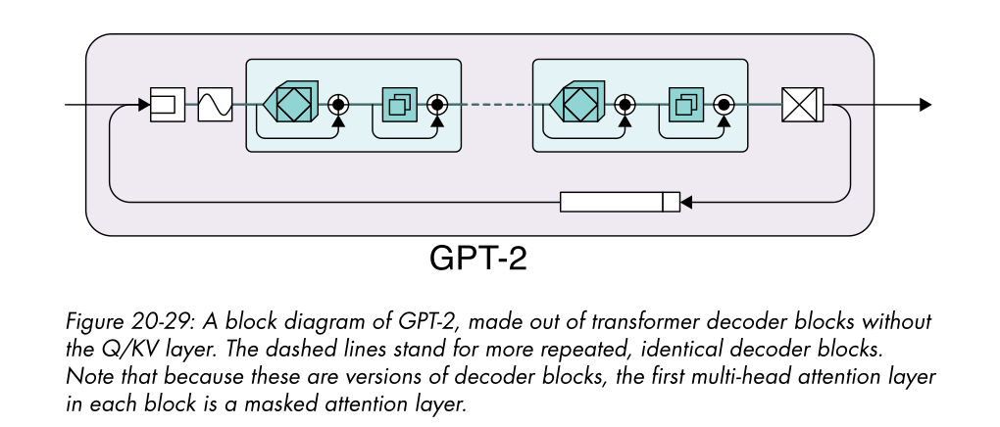

Several versions of GPT-2 were trained, the largest of which had *1.5 billion parameters* (it processed 512 tokens at a time through 48 decoder blocks with 12 heads in each decoder). It was trained on *WebText* dataset which had 40 GB of text (around 8 million documents).

We typically use GPT-2 by fine-tuning the pre-trained base model on additonal dataset, adjusting all the weights in the process.

We give GPT-2 an input prompt and it autoregressively generates output text. Prompt can be *zero-shot* (direct instruction, no examples), *one-shot* (an example given in input prompt) or *few-shot* (giving 2-3 examples in input prompt, though not too many).

Hyper-parameters:
- *n-gram penalty*: GPT-2 can sometimes get stuck in a loop, if the end of a sentence leads back to the start of the same sentence. To prevent that, we can penalize the model if it repeats same words in an *n-gram*.
- *temperature*: We want longer outputs to still make sense together. So instead of just choosing the highest probability word every time, we pick several words with high probabilities and then generate words following on from these. Then choose the generated sequence with highest probability, discard the rest. This is called **Beam Search**. Increasing *temperature* means picking randomly from more high-probability words - 0 temperature means always picking highest probability word.

Besides generation, GPT-2 can also do tasks mentioned in Bert: text translation, a version of cloze test, etc.

**GPT-3** uses the same architecture, but simply scaled up a lot. It uses 175 billion parameters to process 2048 tokens at a time (96 decoder layers, 96 attention heads in each layer). It's trained on *Common Crawl* dataset, having initially a trillion words and 420 billion words after cleaning. Training cost about $4.6 million.

**Data Poisioning** involves adverserial input injected in training data, which causes model to produce some kind of incorrect result in response to a trigger word. It's particularly nefarious because usually data is scraped from various public sources, which can be poisoned by external actors. Unlike adverserial test data in CNN, here the poisoned training data is even more dangerous since it's an inherent part of the model.
- One example is *concealed data poisoning*, where some data is injected in training data to convince model that strawberries are made of cement. It's hard to catch - since training data is so huge, it's impossible to read it all and is instead usually skimmed. Also the false idea can be injected in a way such that targets are never explicitly referred to, making it even harder to catch.
- Another way is changing the training data in a seemingly benign way - eg. rephrasing a news headline from passive voice (which model correctly identifies as "World") to active voice (now model wrongly classifies).

So before using these models, we must first test for bias, historical prejudice, data poisoning, etc. - **unfortunately there's no robust method for definitely detecting these**.

## Reinforcement Learning (RL)
Supervised learning is when we know exact answers (labels) for training data; in unsupervised we don't tell model anything but let it learn on its own. RL lies in between, when we know something about the answer but not the exact answer - i.e., we know one answer is better than another. **RL performs well in uncertain situations, where there isn't necessarily one best answer**.

RL breaks up simulated world into an *actor/agent* (entity that takes action) and *environment* (rest of the world which responds to the action). After action, we give RL model a *feedback/reward* (usually a single number) that tells it how good the action was using some criteria.

Example RL problems:
- Games: Checkers, Chess, Go
- Elevator Scheduling: where should each elevator go when it's empty? an RL model can try out a policy (eg. keep some elevators at top floor, some at ground), using its environment (eg. time of day, traffic pattern throughout day), and then adjust based on feedback (eg. avg waiting time, no. of people waiting, etc.)

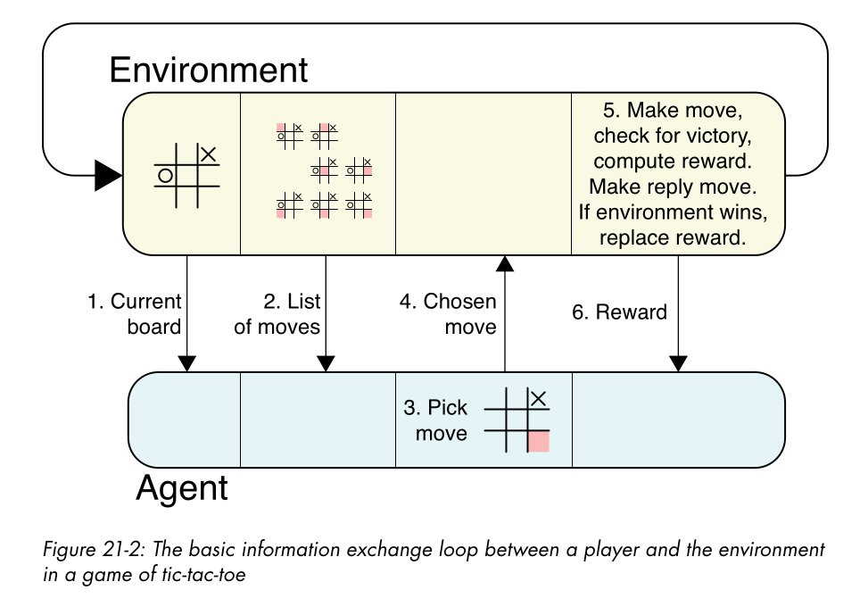

Above image shows basic RL loop (playing a game here). RL model doesn't know what the game rules are, how to win, etc. - all it knows is the input (current board state, and available moves). RL model chooses the move it wants to make, then we actually make that move. If agent won, give a large reward to RL. Otherwise environment makes its move (perhaps using RL itself, with flipped perspective!). If environment won, agent lost, so give low reward. If game ended as result of agent / environment's move, it's called an *ultimate/final reward*.  Otherwise score the current board state on winning chances, send *reward signal* to RL indicating how good move was, and continue game play. 

Sometimes we might not even give the agent the list of available moves (eg. if list is too large). It's provided with some or no guidance, and has to figure out everything on its own. It would play very badly at first, but we hope to improve it with some techniques.

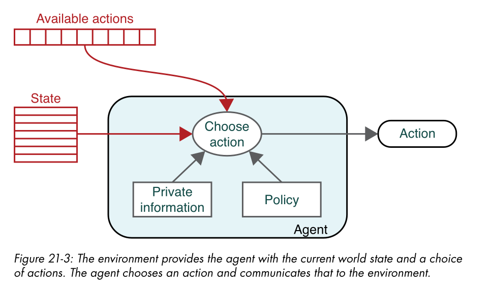

At start of training, place environment into an *initial state*. A full training cycle (such as a game from start to finish) is called an *episode* - usually we train on many episodes. Environment is completely described by *state variables*. RL agent has a *policy* (algo based on which it chooses action), and *private information* (eg. database of history of past moves). Model doesn't actually makes the moves, it simply tells environment and it tries to perform the move.

Based on reward, agent updates its private info and policy. Eg. if agent won, it could add a small reward to each of the moves that led to the win. *Credit Assignment problem* deals with this - if agent wins, how much responsible was each individual move, so how much reward to add to each?

Agent might have *full visibility* (eg. chess) into environment, or only *partial visibility* (eg. some factor unknown / difficult to calculate, we don't know other people's cards in poker).

*Explore or Exploit dilemma*: suppose agent comes across a state, for which a move previously played performed well. Should it play same move again (exploit), or explore a new move?

### Rewards
Rewards are of 2 types: *immediate* (given to agent after each action) and *long-term* (eg. goal of winning game). There are various ways to devise appropriate immediate rewards based on long-term reward - one popular way is *Discounted Future Reward (DFR)*.

Immediate rewards are also of 2 types: *Instant Reward* (reward immediately after agent makes move - predictable), and *Resulting Reward* (reward after environment makes its move which is unpredictable).

When an action works many times in a row but then fails, it's a *surprise*. Environments are of 2 types - *stochastic* (unpredictable) and *deterministic* (eg. purely logic-based game).

**Discounted Future Reward (DFR)**:
- When game ends, calc *Total Reward* as sum of rewards of all moves. For a given move, the *Total Future Reward (TFR)* is the sum of all rewards at and after that move. Since we always use positive reward values, Total Future Reward <= Total Reward for all moves. TFR tells us how well the move contributed to the game, but it's NOT a good predictor for future games (even for exact same moves) - because the environment is unpredictable and can make different move next time.
- *Discount Factor* $\gamma \in [0,1]$ quantifies stochasticity / uncertainity of the environment - it represents our confidence in the repeatability of the environment. The *Discounted Future Reward* accounts for the uncertainity in environment - before summing we multiply next move's reward by $\gamma$, the reward after that with $\gamma^2$ and so on. **We usually start with $\gamma$ around 0.8 or 0.9**, and then adjust the value as we discover how stochastic environment is.

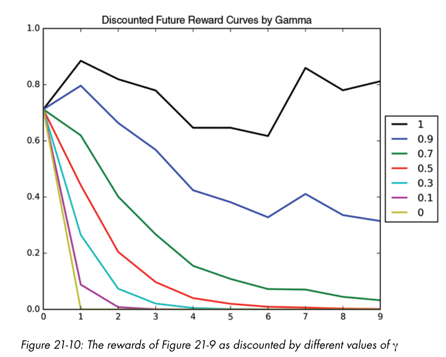

### Q-Learning (Q for quality) for solo game (environment gives rewards but makes no move)
It manages even when there's uncertainity/randomness in environment:
- Initialize Q-table (table of values for each possible state) as 0. Will be updated as we play the game.
- When playing each move, choose an action using Q-table values for the current state based on policy. Initially all move values will be 0, so choose move at random.
- After playing a move, environment gives a reward. Update Q-value of current move based on this reward.

The best values for policy parameter (epsilon-greedy) $\epsilon$, learning rate $\alpha$ and discount rate $\gamma$ have to be found by trial and error. Initially the Q-table has all 0 values, so system plays randomly. But eventually it *converges* to good play.

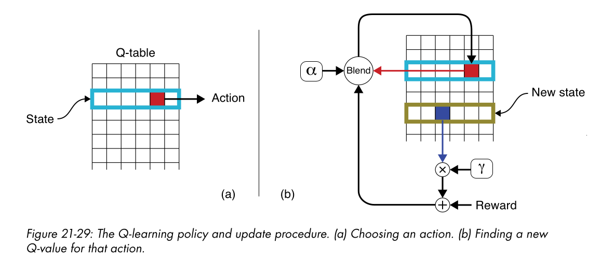

#### Policy for Choosing an Action
- *Epsilon-Greedy*: Usually pick move with max known value (previously stored, this value is its Discounted Future Reward recorded previously). But sometimes with probability $\epsilon$ close to 0 (eg. 0.1), explore a new move.
- *Softmax*: Apply softmax to known values of all moves - this gives probabilities of each move (b/w 0 and 1). Now pick a move based on this probability distribution.

Calculations of softmax can sometimes lead to system not settling down to good values (for each move) after many iterations of play. An alternative (based on same idea of probability distribution) is *Mellowmax* policy.

#### Updating Q-Value
- First calculate new value based on immediate reward (by environment), and the Q-value of new state which represents currently known Discounted Future Reward of the new state: $reward + \gamma \cdot DFR$ (where $\gamma$ is the Discount Factor).
- Now while updating, we don't completely throw away old Q-value. This is because due to some randomness in the environment, we might otherwise end up throwing away a good move just because it didn't work one time. Instead we blend the new and old values with a learning rate $\alpha \in [0,1]$ : 
$\alpha \cdot newVal + (1 - \alpha) \cdot oldVal$. $\alpha$ is kept close to 1 (0.9 or maybe even 0.99). Note that this learning rate DOES NOT have anything to do with learning rate in backpropogation.

### SARSA (improvement on Q-Learning)
Q-Learning has an issue - we calculate future rewards using Q-value of highest value action, but there's a small chance that on next move we'll explore and play some other move. *SARSA (State-Action-Reward-State-Action)* solves this - it chooses next move to play at time of previous move only, calculates future reward, and then remembers & plays the same move in next move. SARSA converges to good moves faster than Q-learning.

### Deep Reinforcement Learning
This strategy of storing a Q-table of all possible board states and moves fast becomes impractical due to large no. of possible combinations, even in a 5x5 Tic Tac Toe board. Instead we can use deep learning to simulate what Q-value would be returned by the Q-table. **Alpha Go** is an example of this strategy - it was trained in this way by playing against itself. Of course one of the hard parts is choosing a complex reward for the current board state (to know how close to winning / losing we are).