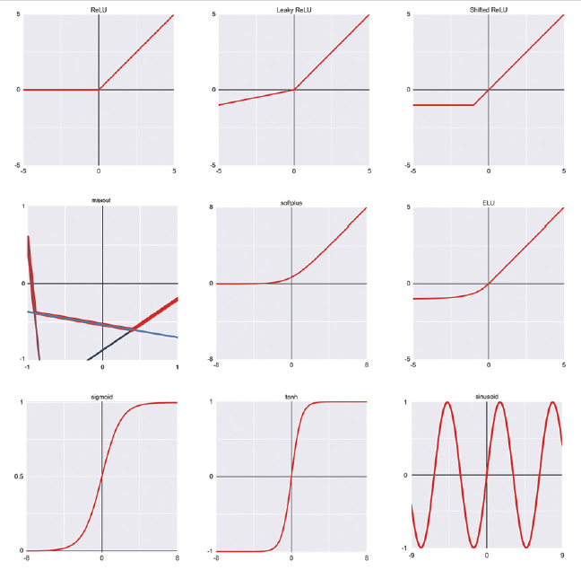

# Notes on Deep Learning
Deep Learning = Neural Networks with hidden layers. They can also have **Support Layers** that don't contain neurons.
**Depth** is the no. of layers in Neural Network (excluding Support Layers like Input Layer).

$$Output = ActivationFunction(Wn \times Xn + ... Wn \times X2 + W1 \times X1 + W0 \times 1)$$
where:
- Weight Vector $W$ = weights of all neurons of layer (wrt current neuron only)
- Input Vector $X$
- **Bias** is weight $W0$ of constant term $1$.

Most Neural Networks are *Directed Acyclic Graphs (DAG)*, i.e., they have no loops/cycles. But there are some exceptions - eg. **Recurrent Neural Networks**.

The most common way to structure neurons is **Feed-Forward Networks** - in which neurons are organized into layers, and each layer feeds its output into the next layer. A layer is said to be *below* another layer if it's closer to the input, and *above* if it's closer to the output. **Fully-Connected Neuron** is one that recieves inputs from every neuron in previous layer, and a Fully-Connected Network is one made entirely of such neurons.

**Each neuron has multiple weights, each representing its connections with a neuron in the following layer.**
If a layer with $N$ neurons feeds forward to a layer with $M$ neurons, then **weight matrix** $W$ has shape $M \times N$, and there's also a **bias vector** of size $M$. To simplify calculation, we can combine bias vector into weight matrix, which now has shape $M \times (N+1)$.

Total Weights in Neural Network = $W(I+1) + W(W+1)(D-2) + O(W+1)$
where $I$, $O$ are no. of neurons in input (no. of features) & output (no. of output classes) layers, and $W$, $D$ are Width, Depth.

There are various algorithms to initialize weights based on normal distribution (bell curve) or uniform distribution (all values equally likely). We don't need to worry about these, the algorithms are automatically chosen by all Deep Learning libraries.

**TODO:** Clarify: 2 layers L1, L2. Does each neuron in L2 have a different weight wrt each neuron in L1, or is each neuron's weight fixed??

## Activation Function
Activation Function is a non-linear function that tests the weighted sum of neurons' outputs to determine final answer*Without any Activation Function, the output of a layer collapses to the equivalent of a single neuron*. Linear activation function can still be used at the output layer, since there are no layers after that.

Some examples of activation functions:
- *Step Function*: value defined at some threshold, 0 everywhere else. *Stair-Step Function* has multiple thresholds where values are defined. *Unit Step* has value 1 at threshold, 0 otherwise. *Heaviside Step Function* is a special case of Unit Step where threshold = 0. **Sign Function** is a variant where value = -1 on left of 0, 1 on right.
- **ReLU (Rectified Linear Unit)** is a peacewise linear function: `0 if x < 0 else x`. Some variations:
    - *Leaky ReLU*: `x * 1/10 if x < 0 else x`. A *parametric ReLU function* lets us choose slope in negative zone - **1 must never be chosen to prevent collapsing into a linear function**.
    - *Shifted ReLU*: ReLU shifted down and left: $0 if x < -A else x$  (where -A is some negative number).
    - **Maxout** generalizes above flavours - it defines a set of lines, and value at any point is maximum value of each line at that point.
    - *Noisy ReLU*: Adds a small random number before ReLU.
    - Some math tricks allow calculating derivative even at the sharp corners in ReLU. This is necessary because calculating derivative is required for training neural network. **TODO:** check more about these.
- *Smoothed ReLU functions*: smoothen the bend between lines in ReLU.
    - Softplus: smooths ReLU
    - Exponential ReLU (ELU): smooths shifted ReLU
    - Swish: smooths ReLU slightly differently - a small bump downwards (negative) between 0 -> straight line.
- **Sigmoid / Logistic Function** is smoothed version of Heavyside Step Function. It *squashes* input domain $[- \infty, \infty]$ to $[0,1]$.
    - *Hyperbolic Tangent (tanh)* is similar to Sigmoid, only negative inputs are sent to -1 instead of 0.
- Sinusoid (sine function)

**Leaky ReLU learns faster than ReLU** because ReLU has the problem that model can get stuck in negative x, since value is constant at 0 (i.e., derivative is 0 for negative x). When a neuron's derivative goes to 0, it stops learning, i.e., *neuron dies*. Sigmoid and Tanh are also popular - **networks learn best when inputs flowing through it are constrained to a range**.

"Activation Function Gallery" page in book:

### Uses
- In hidden layers, usually ReLU or Leaky ReLU is used.
- In output layer:
    - *Regression*: No / linear activation layer is used, since we care about the continous output value.
    - *Binary Classification*: Sigmoid is often used to push output one way or other.
    - *Multi-class Classification*: **Softmax** - it takes as input output scores of ALL neurons, and converts them all to probabilities of each class. Since Softmax accepts all scores, it automatically adjusts the probabilities so that they add up to 1. So it's different from an activation function (that accepts a single weighted output value). It can be calculated using `scipy.special.softmax`:

    $$Softmax(X) = \frac{\exp(X)}{\sum \exp(X)}$$

## Training
- Gradient is n-dimensional extension of 2-d derivative.
- *Momentum* technique prevents algo from stopping at places where gradient is 0 (curve flattens) but point is not a minima or maxima.
- Algo can sometimes get *stuck* (eg. at a local maxima/minima) - it stops learning, accuracy & error rate stop improving.

### Backpropogation
For a single neuron $A$, when its output is changed (holding input and all other weights constant), we expect total change in error of the whole network to be $A\delta$. **In Backpropogation, we find this $A\delta$ for each neuron.** The change in output in the neuron can be because of a change in its weights, or its inputs. 

$$A\delta \times AOutputChange = NeuralNetworkErrorChange$$

NOTE: This delta value is temporary - it changes every time the network's inputs and/or weights change. That's why we adjust weights once per sample, because delta will change even when the inputs change.

Deep Learning libraries have error functions that use *Cross Entropy* to find both the network's error, and an error gradient that tells us how the error will change if any of the neuron's inputs change.
**TODO:** Recheck this.

We can calculate deltas of neurons of the preceding layer $A$ based on deltas of current layer $B$ like this:

$$A0\delta = B0\delta \times Wa0b0 + B1\delta \times Wa0b1 + ...$$

This is why it's called *backwards propogation*, since we're calculating deltas of each preceding layer based on the forward layer's deltas.

**Error Curve**: For a particular weight (holding input and all other weights constant), curve of possible inputs to errors.

**Gradient Descent**: Finds gradient of error curve for all weights at once, and adjusts the weights accordingly. We usually make small changes to each individual weight so that mistakes in a few weights don't dominate the whole thing.

**TODO:** Re-read Backpropogation chapter. Also in book's discussion activation functions were ignored - check how Backpropogation changes after considering activation functions also.

### Optimization
Figure out how much to actually change the weights based on deltas calculated in Backpropogation.

#### Hyper-Parameters
- Learning Rate $\eta \in [0,1]$: Controls by how much weights change in one go - 0 means no change, 1 means big change. It's kept close to 0 - **usually 0.01 to 0.0001**. There's a tradeoff: too low learning rate means model learns very slowly, but too high means it can overreact and jump too much, increasing error instead of decreasing.
    - Constant Learning Rate
    - Learning Rate reducing with Decay Schedule:
        - Exponential Decay: decay on every epoch
        - Delayed Exponential Decay: delay decay for a few epochs
        - Interval / Fixed-Step Decay: decay on every Nth epoch
        - Error-based Decay: decay only when model error stops improving
        - Bold-Driver: Inc. learning rate (say 5% or 10%) when error is reducing; half learning rate when error increases significantly.

- *Batch/Epoch Gradient Descent*: Accumulate errors, Update weights only per epoch (so after all samples are done). It's called an *offline algorithm* because all the samples must be available in memory.
- *Stochastic Gradient Descent (SGD)*: Update weights after every sample; Each time samples come in random order. It's noisy - error can change drastically between epochs. It's an *online algorithm* because it doesn't require the samples to be stored or even consistent between epochs.
- **Most Common:** *Mini-Batch SGD*: Update weights after every Nth sample in an epoch. This N is called mini-batch size. Usually we pick a mini-batch size according to the GPU architecture.

Optimize Mini-Batch SGD to learn faster:
- *Momentum Gradient Descent*: Add some *inertia* (previous change in the weight, multiplied by *momentum scaling factor*) to the current change in weight. The purpose is to stop from getting stuck in plateaus or valleys. Usually the scaling factor $\gamma$ is set to around 0.9.  **TODO:** Re-read.
- *Nesterov Momentum*: Estimate gradient at future point (after current change), and use that to influence current weight change - if estimated gradient at future point is in same direction as right now, then take a larger step ; if it's in opposite direction, then take a smaller step. Uses same momentum scaling factor $\gamma$, but learns more efficiently. **TODO:** Re-read.

Adaptive Learning Gradient Descent (where each weight can have different learning rate - above methods all had same learning rate for each weight):
- *Adagrad (Adaptive Gradient Learning)*: For each weight, keep running sum of squares of gradients (square ensures it's always positive). Divide gradient by a value derived from this sum. Since each weight's learning rate decays uniquely tailored to that weight, initial learning rate isn't that important (usually we use a small initial value like 0.01).
- *Adadelta*: Keep a *decaying sum* of gradient squares - older gradients are multiplied with smaller coefficients so they have less influence. A parameter $\gamma$ (NOT related to Momentum Scaling Factor) decides how much older gradient squares contribute to the decaying sum - they contribute more for larger $\gamma$. *RMSProp* is a similar algorithm - RMS because it uses Root Mean Square.
- *Adam (Adaptive Momentum Estimation)*: Uses 2 running lists (gradients squared, and actual gradients) to find scaling factor. Learns much faster. 2 params whose recommended values are: $\beta1 = 0.9$, $\beta2 = 0.999$. **TODO**: Check what these parameters actually mean! **Generally used** since it's slightly better than above adaptive algos (Adagrad, Adadelta, RMSProp).

In complex cases, Adaptive algorithms typically learn faster.

**No Free Lunch Theorem**: There's no "best" optimizer for all cases - it's always possible to find an optimizer that learns better in a certain kind of task.

Usually start with Adam - when any big change is made to the network or the data, try out different optimizers (either manually or with automated funcitons in Deep Learning libraries).

#### Regularization
Delay overfitting by a few epochs.
- **Dropout**: It's an *accessory / supplemental layer* because it doesn't do any computation of its own. Only active during training, disabled in inference. In each training mini-batch, it randomly disables a percentage of neurons in previous layer (so they aren't used in inference and don't learn in backprop) - percentage is a parameter. *This prevents any neurons from over-specializing and dominating*. Different strategies for where to place dropout layer are there, but usually it's placed between hidden layers, not directly after input or output layers.
- *Batch Normalization*: It scales & shifts all outputs of a layer to a small range around 0 (eg. $[-1,1]$) because activation functions (like Leaky ReLU) have greatest effect around 0. It's placed before the activation function of the layer it's affecting.