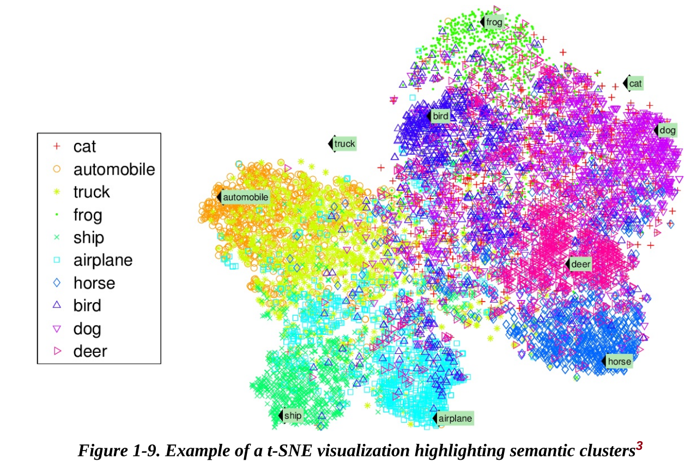
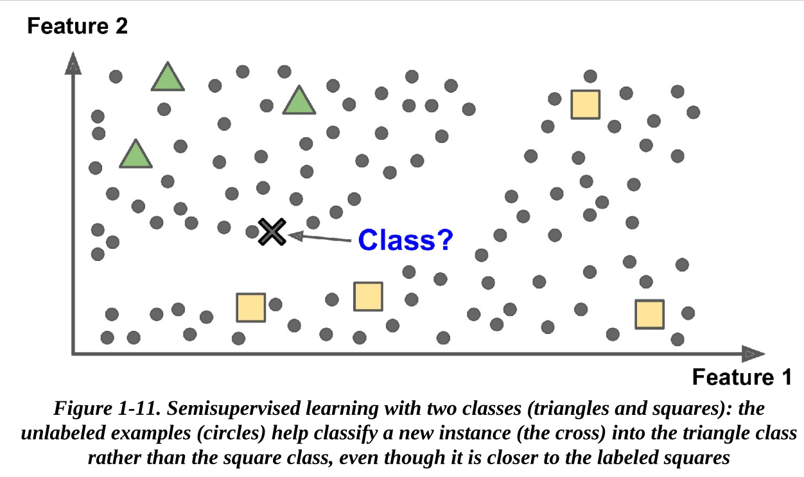
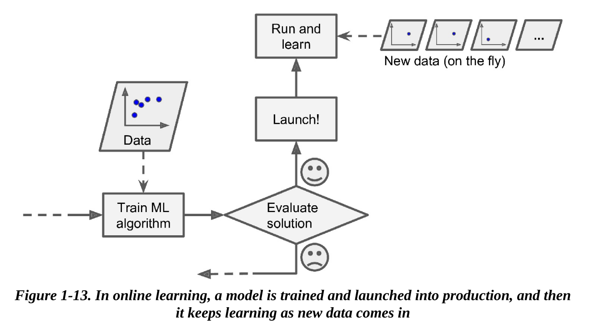
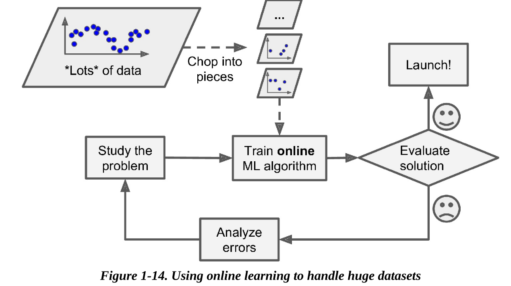

# Book: Hands-On Machine Learning with Scikit-Learn, Keras, and TensorFlow

## Theory

**Generalization / Out-of-Sample Error** is error rate of model on test data (unseen data). Low training error but high generalization error indicates Over-Fitting. In **holdout validation**, we create a seperate *validation set* that's only tested after all hyperparam tuning, etc. is done. **Data Snooping** means snooping at the test data (even exploring it with eye!) before-hand, and can again lead to a model that doesn't perform as well on actual data.

While splitting data into train & test, we usually use random sampling. But for smaller datasets this can cause sampling bias (i.e., proportion of classes is different in test & train data than in real-world data). For smaller datasets, we can use **stratified sampling** - eg. if we know women are 52% of a population and men are 48%, then we can sample in such a way that this proportion remains same. That is, population is divided into homogenous subgroups called *strata*, and we sample from these according to known proportions.

**Regression**:
- Types are:
    - Multivariate : multiple output vars (or Univariate for single output)
    - Multiple Regression means multiple input vars
- Error functions: *RMSE is more sensitive to outliers than MAE. But when outliers are exponentially rare (like in a bell-curve), RMSE is preferred*.
    - Root Mean Square Error (RMSE) : uses Euclidean Distance (l2 norm)
    - Mean Absolute Error (MAE) : uses Manhattan Distance (l1 norm)
    - More general **$l_k$ norm** (distance measurement) : $(\sum (y_i' - y_i)^k) ^ {1/k}$, where $k$ is index of norm. Higher index of l norms focuses more and more on larger errors over smaller errors.

**Unsupervised Learning** tasks: 
- clustering (eg. k-Means Clustering)
    - *Heirachical Clustering* means model divides data into groups, then also divides groups into sub-groups
- dimensionality reduction (eg. PCA)
- association rules / finding relationships between data - model types (*Apriori*, *Eclat*) - eg. frequently bought together products, organize medical datasets for clinical diagonisis, etc.
- anamoly detection (eg. 1-class SVM for detecting unusual transactions)
- visualization algos: feed them complex unlabeled 2D or 3D data, they figure out best way to visualize it so we can understand how data is organized (while maintaining properties like clusters in data). Example of *t-SNE* visualization algo:

Classification algos (like Decision Trees) can be used for regression, and vice versa - Logistic Regression is commonly used in classification as well (it can output probability of data being in a class).

**Semi-Supervised Learning** algos can learn from partially labeled data - i.e., some part of training data is labeled, other is not. They usually use a mixture of supervised and unsupervised learning algos. Eg. in Google Photos, it uses unsupervised clustering algo to group pics with similar faces, then supervised learning to actually identify the faces (who each person is), so that now photos can be searched by person name. Another example is *deep Belief Networks* - first they use unsupervised components *restricted Boltzman machines*, then use supervised learning for fine-tuning.

### Batch (Offline) vs Online (Incremental) Learning
*Batch / Offline learning* algos are those which can't be trained incrementally - for incorporating new training data into a model, the model needs to be retrained with old + new data, it can't be trained on just the new data. 
Batch Learning can also be done on datasets bigger than memory using distributed training (diff batches on different machines) - eg. Google MapReduce technique.

In *Online / Incremental learning*, you train the model by feeding it data sequentially, either individually or in *mini-batches* - each learning step is fast and cheap so system can learn from new data on the fly. 

Online Learning is good when:
- data arrives continously (eg. stock prices) and we need to adapt quickly
- limited memory storage - old training data can be discarded as it's not required for retraining with new data
- **Out of Core learning**: when datasets are too big to fit in memory, we can load data in batch, train on it and then train on next batch. 

An important parameter of Online Learning is **learning parameter**. If it's too high, then model will quickly adapt to new data but also forget old data. If it's too low, model will adapt to new data very slowly due to inertia, but will also be less sensitive to noise / outliers in data.

Challenge in Out of Core learning is that if bad data is fed to the system, model performance will gradually decline. To prevent this, system needs to be monitored closely and learning turned off (& revert model to previous version) when performance drops:

### Instance-based vs Model-based learning
In *instance-based learning* methods (eg. k-Nearest-Neighbours), the whole training data is stored / memorized and then for new data, some similarity method is used to compare it with training data to decide result.

OTOH in *model-based learning*, training data is not memorized but instead model learns to make predictions using training data - eg. linear regression. Model is trained using either a *utility function* (which tells how good the model is) or a *cost function* (which tells how bad the model is).

### ML Challenges
In the paper "Unreasonable Effectiveness of Data", researchers showed that different models performed almost identically given enough data. So with big enough (quality) data, choice of algo matters less. But algo still matters for small to medium sized datasets.

#### Data
Training data should be representative of real data on which inference will be done so that model can generalize well. If sample size is too small, it will have **sampling noise**; even bigger samples can be non-representative due to **sampling bias** (flaw in sampling method).

**Data Cleaning**: To prevent poor quality data (filled with errors, outliers & noise), we need to clean data before training:
- If some data are clearly outliers, it may help to discard them or fix them manually.
- Missing data in a feature can be dealt with in varioius ways: ignore the feature, ignore the instances (rows), impute (fill in the missing values, say with median), or train 2 models - with & without the feature.

**Regularization (reduce Over-Fitting)** constrains a model to make it simpler and reduce risk of overfitting. Eg. linear regression normally has 2 *degrees of freedom* (slope and intercept). If we fix one of them, now only 1 degrees of freedom remains. But if we constrain the model such that both parameters have to be small, then the degrees of freedom is between 1 and 2 - this helps the model to better generalize to new data. This amount of regularization can be controlled by a hyperparameter between 0 and 1 - at 0 (means one param fixed) it's unlikely to overfit but also not likely to find a good solution.

Solutions for **fixing Under-Fitting**:
- select more powerful model, with more parameters
- Feature Engineering - feed more relevant features to model
- reduce model constraints, i.e., regularization hyper-param

### Open Datasets
- [UC Irvine ML Repository](http://archive.ics.uci.edu/ml/)
- [Kaggle datasets](https://www.kaggle.com/datasets)
- [Amazon's AWS Datasets](https://registry.opendata.aws/)

Meta Portals (list open dataset platforms)
- [DataPortals](http://dataportals.org/)
- [OpenDataMonitor](http://opendatamonitor.eu/)
- [Quandl](http://quandl.com/)

Pages listing open dataportals
- [Wikipedia page of ML portals](https://en.wikipedia.org/wiki/List_of_datasets_for_machine-learning_research)
- [Quora question (open datasets)](https://www.quora.com/Where-can-I-find-large-datasets-open-to-the-public)
- [r/datasets](https://reddit.com/r/datasets)

## Practice
TODO: implement the various scripts for models given in the book

Sklearn:
- `sklearn.model_selection.StratifiedShuffleSplit` - provides various ways of splitting data in stratified sampling (i.e., we are targeting a known proportion of each class). Useful for smaller datasets. Since several different splits are provided, we can use it for cross validation (train & test model using various test-train splits).

Pandas:
- `df.corr()` calculates correlation between every pairs of attributes/columns.
- `pd.plotting.scatter_matrix(df)` plots correlation between every pairs of attributes.

### Scikit-Learn Design Principles
We'll use an `imputer = SimpleImputer('median')` as an example, other *estimators* work the same way.
- Consistent Interface:
    - *Estimator* has `.fit()` method to estimate parameters based on dataset (for supervised learning, labels also required). Metadata (eg. `imputer`'s `strategy`) passed in class constructor.
    - *Transformer* is an Estimator having a `.transform()` method that transforms the dataset to return a new dataset. These are simple rule-based strategies, used in data preprocessing. `.fit_transform()` does both fit & transform at once.
    - *Predictor* is Estimator that's actual ML model (eg. `LinearRegression()`). It has `.predict()` method that takes dataset input and returns predictions for each row. (also `.fit_predict()`). `.score()` method gives a single number that tells how well prediction was done (eg. R^2 score for linear regression).
- Inspection: estimator's hyperparameters directly available as properties (eg. `imputer.strategy`); 
              learned parameters attribute has underscore (eg. `imputer.statistics_`).
- Datasets are Numpy arrays or SciPy sparse matrices. Hyperparams are simple numbers.
