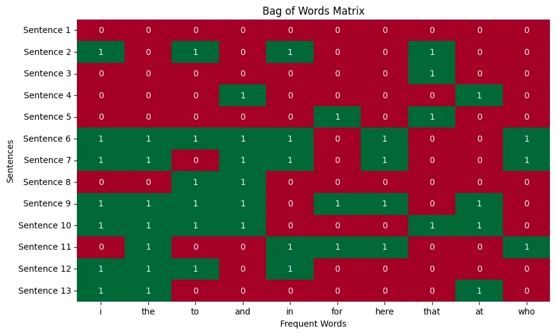
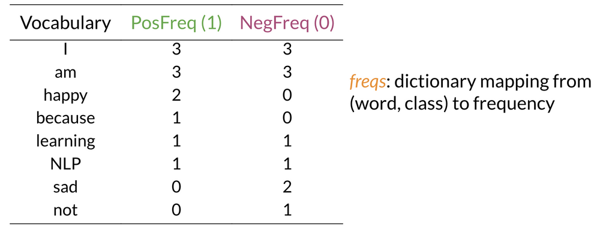
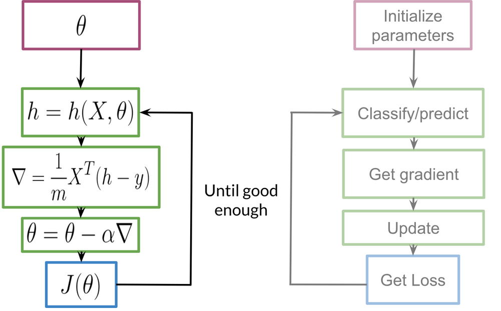
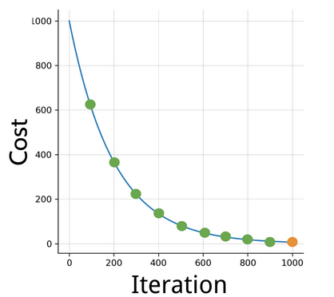

# [Natural Language Programming (NLP) with Classification & Vector Spaces](https://www.coursera.org/learn/classification-vector-spaces-in-nlp/)

*Vocabalary* is set of unique words in text. *Corpus* is set of all documents / sentences.

NOTE: [Lecture Notes of all 4 weeks of this course](https://community.deeplearning.ai/t/nlp-course-1-lecture-notes/64244)

## Common

### Text Preprocessing
- rm URLs, social media handles (eg. start with @ or #)
- tokenize into words
- rm stop words: is, and, the, on, etc.
- **Stemming**: convert every word to its stem, eg. {dancer, dancing, danced} -> dance. `nltk.stem.porter.PorterStemmer()`
- words to lower case

### [Vectorization Techniques](https://www.geeksforgeeks.org/nlp/vectorization-techniques-in-nlp/)

Words need to be converted to vectors before using ML using techniques:

IGNORE WORD ORDER & CONTEXT:

- *One-Hot Encoding* (eg. 0 0 0 1 0 0 0 ..): each word's vector has 1 at word's index (in vocabalary), 0 elsewhere: `sklearn.preprocessing.OneHotEncoder()`

- [**Bag of Words** / CountVectorizer](https://www.geeksforgeeks.org/nlp/bag-of-words-bow-model-in-nlp/): using N most frequent words, mk matrix of sentences vs words (values = word frequency in sentence, 0 if absent): `sklearn.feature_extraction.text.CountVectorizer()`

- **Term Frequency-Inverse Document Frequency (TF-IDF)**: an extension of Bag of Words, weighs freqeuncy of words by importance across documents: `sklearn.feature_extraction.text.TfidfVectorizer()`
    - Term Frequency (freq of word in document): $TF(T,D) = \frac{CountTInD}{TotalTermsInD}$ where T = term, D = document
    - Inverse Document Frequency (importance of word in all docs): $IDF(T) = log(\frac{TotalDocuments}{DocumentsContainingT})$
    - `TFIDFScore = TF * IDF`
    - produces high-dimensional sparse vectors

PROBLEM: sparse vector representation cost large training & prediction times.

## Week 1: Logistic Regression: Binary Classification

### Feature Extraction with Frequencies

*Positive & Negative frequencies*: frequency of each word in positively classified sentences (cumulative), and negatively classified. 
This creates frequency table from training text:

Now for each sentence - PositiveFeature = sum of positive frequencies of words in sentence, similarly for NegativeFeature. Take Bias as 1.
Then vector of 3 elements: `[Bias=1, PositiveFeature, NegativeFeature]`

Mk feature matrix $X$ with extracted features (above vector) as rows, for each sentence (columns).

Apply sigmoid to freq vector of 3 elems: $h(x, θ) = \frac{1}{1 + e^(- θ^T x)}$ where $θ$ = sigmoid parameters. 
**This gives final probability** - positive if >= 0.5, else negative class.

Accuracy = No. of correctly predicted / Total no. (m)

### Logistic Regression Training

Learn sigmoid parameters over several epochs using gradient descent until cost converges to minima:

Here: 
- $h$ is sigmoid classify vector of 3, $h-y$ is prediction error
- m = no. of training sentences (so scale by 1/m), n = no. of features + 1 (for bias)
- $J(\theta)$ is cost function. Loss is for single sentence/data, **Cost** is average loss for all sentences.

Train until cost converges:

Cost is Negative Log Likelihood (to minimize): $J(\theta) = -\frac{1}{m} [y * log(h(x,\theta)) + (1-y) * (1 - log(h(x,\theta)))]$

