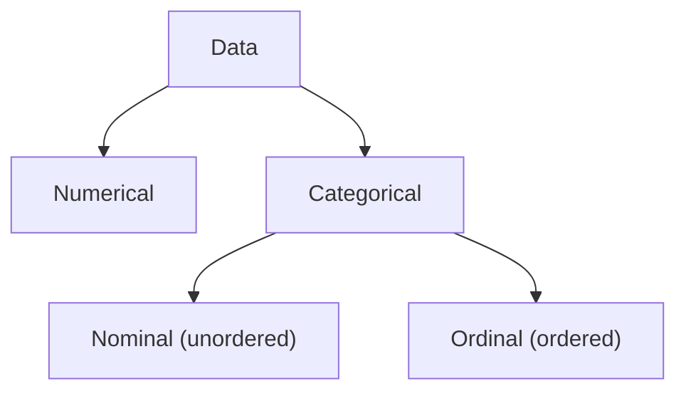
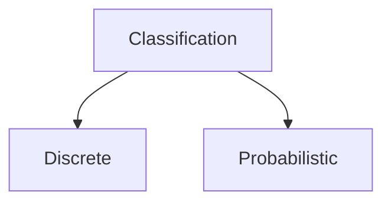

# Notes on Machine Learning & Deep Learning
- Supervised - ML learns rel b/w input & label
- Unsupervised - ML learns rel b/w diff parts of input. One application is *clustering*
- Reinforcement - (involves multiple steps/predictions instead of single) ML takes a few steps, then humans rate it as better/worse than another approach. Eg. AlphaGo
- **Deep Learning = ML with hidden layers**

Eg. of **pure ML models dont have any hidden layers** - Linear Regression, Logistic Regression, Random Forests, Support Vector Machines (SVMs), k-Nearest Neighbours, etc.
ML algos work best with *Independant & Identically Distributed (IID)* variables.

- In training loop, both hyperparameters and model weights are tuned.
- *Data Leakage / Contamination* is when some data is present in both training & test data.
- Train-Test-Validation split is typically 60:20:20.
   - Validation data is used after every epoch to see model tranining performance - 
      since it's used in every train epoch, it has some data leakage. 
      That's because even though our model didn't see validation data, the training system did - 
      it used validation data performance to tune hyperparameters.
   - Test data is used only after training is done.

*Wierdness of Higher Dimensions*: Higher Dimensions have many unintutitive properties, so it's best to rely on math instead of our intuition in these. For example, at high dimensions, volume of hyper-sphere approaches 0% of volume of smallest hyper-cube that fully occupies it.
  
- **Cross / Rotation Validation**: Used when we have very limited data, so can't afford to split seperate test data.
    - Train multiple models - in each, split train & validation data differently from the same data.
    - One technique for splitting train & validation data for each model is *k-Fold Cross Validation*.
      Divide data into k groups. Then generate N sets of train & validation data: validation has chunk no. i, train has rest.
    - Optional final step (assuming we watched out for overfitting in the previous models):
    Train final model with whole model. Its performance should be better than that of worst model (out of models previously trained)

### [Underfitting & Overfitting](https://www.kaggle.com/code/dansbecker/underfitting-and-overfitting)
*Underfitting* is easy to fix - just add more training data. Methods to fix *Overfitting*:
- While training, if validation error doesn't decrease for a few training epochs, *Early Stop training*.
- **Regularization** methods delay over-fitting to later epochs. A popular way is to limit the values of the parameters used by the classifier. By keeping all of the parameters to small numbers (i.e., all are roughly in the same range), we prevent any one of them from dominating. This makes it harder for the classifier to become dependent on specialized, narrow idiosyncrasies. Amount of regularization to apply is specified with a hyperparameter $\lambda$ - higher $\lambda$ means more regularization and smoother curves. **TODO:** What is formula for amount of regularization, and practically how does it affect regularization?

- *Bias* measures the tendency of a system to consistently learn the wrong things (underfitting)
- *Variance* measures its tendency to learn irrelevant details (overfitting).
- **Bias-Variance Tradeoff**: As bias reduces, variance tends to increase (& vice versa).
- Usually we want *low bias (simpler curves) & low variance (model can generalize well).*
  But there are some exceptions where we don't care about one of bias or variance:
    - If data is perfectly representative of future data, then we don't care about high variance 
    since we want the model to fit the data perfectly.
    - If data is not a good representative of future data, then we prefer low bias (so that model gives some reasonable answer on future data) don't care about variance (fitting the data isn't too important because it's lousy data).

**TODO:** Go through (& implement) example at: 
- book "Deep Learning - A Visual Approach" 
- chapter "Underfitting & Overfitting"
- my comment "Bayes Rule Example: Curve-Fitting"

## Data - Types, Cleaning
**Data Types:**

**Data Cleaning:**
- *Dealing with Missing Values*: One approach is to just drop the columns having missing values. But this is not recommended because the column could have important information. Instead a better approach is to fill in missing values with the column's average using [`sklearn.impute.SimpleImputer`](https://www.kaggle.com/code/alexisbcook/missing-values#Score-from-Approach-2-(Imputation)).
- [*Dealing with Categorical Data:*](https://www.kaggle.com/code/alexisbcook/categorical-variables) Categorical data are like Enums - they have one of a fixed set of values (eg. `male`, `female`, `other`). 
2 approaches:
   - Ordinal - convert to 1 numerical column having values like $0, 1, 2, ..$
   - One-Shot Encoding - convert to mutiple columns (one for each value in fixed set), each having value 1 or 0 to indicate whether the value is present or missing. It's *impractical on large no. of columns (>= 15)*. **It's usually slightly better than Ordinal encoding.**

## Problem Types

### Regression
Predict a numerical value - *eg.* predict house price (say $100,000). Models are evaluated using **Mean Absolute Error**. *Eg.* [This Kaggle code](https://www.kaggle.com/code/dansbecker/model-validation) shows how to do regression using `sklearn.tree.DecisionTreeRegressor`.

### Classification

#### Probabilistic Classification
- Predict the probability of output classes. For example, [this (unsolved) problem](https://www.kaggle.com/competitions/playground-series-s4e1/overview) asks us to predict probability (b/w 0 to 1) of whether a customer continues his account with the bank or closes it. 
- Models are evaluated using [Area under ROC Curve](https://en.wikipedia.org/wiki/Receiver_operating_characteristic), which plots True Positive Rate against False Positive Rate at each probability threshold.
- **TODO:** Check this in detail.

#### Discrete Classification
When we can split things up this nicely, we call the sections into which we chop up the plane *decision regions / domains*, and the lines or curves between them *decision boundaries*.

Multi-class classification using **Boundary Classification** ML methods:
- One vs Rest / Binary Relevance: multiple binary classifiers, one for each class (eg. A | ~A). 
For any input, inference on all; ans = one where predicted with max probability.
- One vs One: multiple binary classifiers, one for each combination of classes. Each classifier votes, label with max votes wins.

**K-Means Clustering**: *Unsupervised ML* model: cluster using averages of groups of points
- k (hyperparameter) = no. of clusters
- *Curse of Dimensionality:* Past a certain point, adding more dimensions (features) can make it harder for ML to accurately classify.
That is, it's hard for the model to create clusters of points that *generalize*
Reducing k (no. of clusters/bins) helps, but after enough dimensions the situation isn't improved (i.e., density -> 0)
- *Blessing of Non-Uniformity / Structure:* Most real-world data doesn't tend to uniformly spread: a few regions will be dense, most spaces will be empty. So having good enough density at the dense regions is sufficient.
- This is why, if an ML system has lots of features, we will *need a large amount of training data* to accurately classify.

## Machine Learning Models
- [Random Forests vs Decision Trees](https://stats.stackexchange.com/a/285835/406211): A Random Forest randomly selects observations/rows and specific features/variables to build multiple decision trees from and then averages the results. After a large number of trees are built using this method, each tree "votes" or chooses the class, and the class receiving the most votes by a simple majority is the "winner" or predicted class

## Training - Gradient Descent
Gradient is n-dimensional extension of 2-d derivative.

*Momentum* technique prevents algo from stopping at places where gradient is 0 (curve flattens) but point is not a minima or maxima

Algo can sometimes get *stuck* (eg. at a local maxima/minima) - it stops learning, accuracy & error rate stop improving.

## Performance Metrics
- Type I Error = False Positive (FP)
- Type II Error = False Negative (FN)

_     | Positive | Negative |
----- | -------- | -------- |
True  | TP       | TN       |
False | FP       | FN       |

- Precision (Positive Predictive Value) = TP / (TP+FP)
- Recall / Sensitiivity / Hit Rate / True Positive Rate = TP / (TP+FN)
**Precision-Recall Tradeoff**: As one goes up, other goes down

- Specificity = True Negative Rate = TN / (TN+FP)
- **F1 Score**: combines both precision and recall. when F1 score -> 1, that means both Precision, Recall -> 1

$$F1 = \frac{2 \times TP}{2 \times TP + FP + FN}$$
   
While drawing confusion matrix, prior info should be taken into account.
*Eg.* if we know in advance that only 1% of population has disease, we should draw confusion matrix taking that into account. In this example, test has 99% accuracy - but Precision is only 33%, i.e., out of all predicted with disease, 67% are false positives!
  

## Statistics
- Probability Mass Function is just another name for Discrete Probability Distribution
- UniformDistribution(x) = 1 if 0 <= x <= 1 else 0
- In a Normal / Gauss Distribution / Bell Curve:
   - Mean = Median = Mode
   - low standard deviation means narrow bump of bell curve
   - **Three-Sigma Rule in a normal distribution**:
      - 1 std. dev. (area around both sides of mean) = 68% of total curve area
      - 2 std. dev. = 95%
      - 3 std. dev. = 99.7%
- Bernoulli Distribution (discrete) - only 0,1 are possible values. Eg. probability of head/tail on tossing a coin
- Multinoulli / Categorical Distribution (discrete) - one of more than 2 possible values.
- **Bootstrapping** - estimate mean of large population
  - init sample = Sample Without Replacement (SWOR)
  - Resample from init sample using Sample With Replacement (SWR) - each of these new samples are called Bootstraps
  - Draw distribution of mean of Bootstraps
  - Now from this distribution (it's an approx bell curve of actual population), 
    we can say for example that p% of population is b/w x1 and x2 - this is called a *Confidence Interval*.
  - Even with a large population (eg. millions), we can make small bootstrap samples of only 10-20 vals each.We can gen. thousands of such bootstraps - the more we generate, the more the curve approaches Normal Distribution & becomes more accurate
- Covariance (C): $dy \approx C \times dx$ (one var is approx fixed multiple of each other).
    - Correlation (b/w -1 and 1) is better because it's independant of scale, units - 
      we can compare whether one set of vars is more strongly correlated than another.
    - *Partial Correlation* = multi vars, we are only checking correlation between 2 of the vars
  
**Posterior-Prior Loop**:
Bayes Rule (Conditional Probability) loop - each experiment gives us a better value of $P(A)$:
- Known: *likelihood* $P(A|B)$, *evidence* $P(B)$
- let $P(A) = p$   (initial guess of its probability)
- repeat N times:
    - peform experiment, observe what happens (outcome = $B$ or $\neg B$)
    - *Bayes Rule:* $P(B|A) = \frac{P(B) \times P(A|B)}{P(A)}$   (old $P(A)$ is the *prior*)
    - now update $P(A) = P(B|A)$ since we know B happened (or $P(\neg B|A)$ if B didn't happen) - new $P(A)$ is the *posterior*.

## Information Theory
**Variable-bitrate code / Adaptive code** - chars have variable-length encodings, optimized so that more frequent chars are shorter.
- *Eg.* Morse Code
- *Compression Ratio* (0 to 1): No. of bits req in Adaptive Code / No. of bits req in Fixed-Length code ; 
1 means no savings, lower the ratio, higher the savings from using Adaptive Code. **TODO:** Check if this formula is strictly accurate.

**Entropy:** min no. of bits required to send a message, using an encoding scheme perfectly tuned to that message. **TODO:** Check Entropy range, formula (is it actually equal to min bits or is it proportional to it?)
- *Cross Entropy* (way to compare 2 probability distributions): tells us how many more bits we need if using some other, less perfect, encoding. If 2 probability distributions are identical, their Cross Entropy is 0.
Cross Entropy is assymetrical - cross entropy of A wrt B != cross entropy of B wrt a.
- *Binary Cross Entropy* is a special case when 2 chars in alphabet.
(i.e., binary classification problem, where we're calculating cross entropy of a Probability Distribution Function (PDF) of model prediction wrt PDF of actual labels.)
- Higher cross entropy means higher error
- *Relative/Cross Entropy* = extra no. of bits req using imperfect code $Entropy - CrossEntropy$. **TODO:** Cross vs Relative Entropy ; calc Entropy, Cross Entropy, Rel. Entropy in an example
- KL Divergence is similar to Cross Entropy (tells us how much error). But Cross Entropy is faster to calculate, so that one is used in practice.

## Learning Resources
- Book "Deep Learning - A Visual Approach"
- Kaggle Tutorials & *Getting Started* problems - *eg.* [Titanic Problem](https://www.kaggle.com/alexisbcook/titanic-tutorial).
