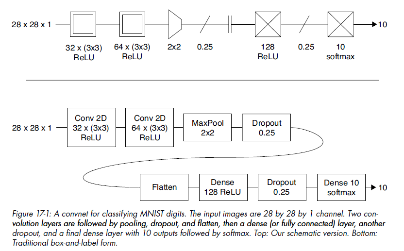
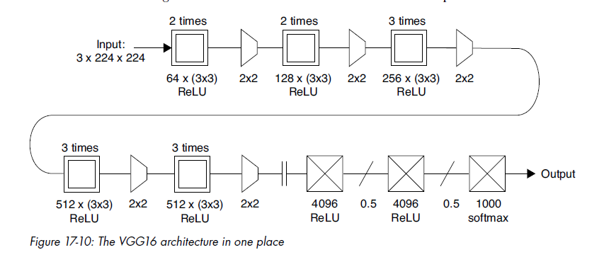
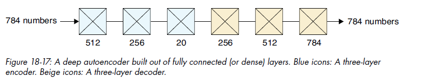
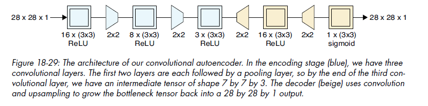
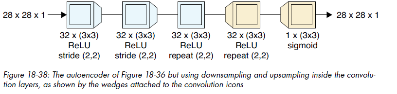
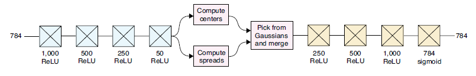

# Neural Network Architectures
Basic feed-forward networks were [previously discussed](DeepLearning_NOTES.md). Now different architectures of Neural Networks will be discussed.

### Image Processing
Image Tensors' dimensions depend on the no. of channels:
- Grayscale - 1D (each pixel has only one colour value)
- Coloured  - 3D (each pixel has RGB colour values)

Each image is a sample, and each image pixel is a feature.

**Sliding vs Rolling Windows**: Sliding (overlapping window), Rolling (non-overlapping window)

## Convolutional Neural Networks (CNN)
Deep Learning Models in which Convolutional Layers play a significant role. *All-Convolution Networks* have all layers as only convolutional layers.

**Applications:** Very successful in images (classification, modification, generation), also used in other domains like NLP (understanding sentence structure, sentence classification).

We can make a neuron *filter* to detect yellow (one value to detect yellowness from 3 initial RGB values): $ReLU(R+G-B)$ and then *sweep* it over all image pixels. *Sweeping* corresponds to **convolution** matrix operation. To make this faster, we can make a huge grid of neurons, each with identical weights, and apply it at once to the image - this is called *weight sharing*.

Convolution of input matrix $A$ with kernel matrix $B$ involves flipping kernel and sliding it over input, calculating sum of element-wise product (where both matrices are of size $M \times N$):

$$C(i, j) = \sum_{m=0}^{M-1} \sum_{n=0}^{N-1} A(i+m, j+n) \cdot B(m, n)$$

We can also sweep over the image with a *spatial filter*, where several pixels centered over an *anchor* points are processed at once by a single neuron. Its *footprint / local receptive field* is the shape of the input pixels passed to a single neuron - eg. we can process a pixel and its 8 neighbours at once (3x3 square shape) - so the neuron has 9 input features (assuming grayscale image). Usually small square $side \in [1,9]$ with odd size is used.

*Feature* (NOT the same as before, where it simply meant columns) also refers to a particular type of structure that a neuron is looking for (eg. zebra stripe). So the filters are also called *feature detectors*, and their output *feature map* tells us (for each pixel) how well image around that pixel matched feature we're looking for. Applying one filter, then another filter on outputs of first filter, and so on, allows us to detect very complex features.

Around the border of the image, we add *Padding* - extra elements, usually 0, so that spatial filter can get values at corners also. Thickness of border padding depends on size of filter.

For RGB images (3 channels), spatial filter and footprint both have 3xNxN size (where N is side of square). *Every filter must have same no. of channels as the image it's filtering*.

*Convolution Layer*: applies many filter neurons simultaneously & independantly on the image. Usually same padding is used in all the filters of a layer. Its output tensor will have as many channels as filters in the layer.

*Initial (Random) Weights* are usually chosen automatically by library. Best algos are by He, Glorot.

**1D Convolution**: special case where filter moves only in one direction, width or height. Eg. NLP - grid where rows are words (each cell is a letter), and spatial filter of size same as width is swept only in vertical direction.

**1x1 Convolution** (feature/channel reduction): a layer can have many similar filters that can be combined. Eg. a layer has 300 filters, then next layer has all its filters 1x1 (i.e., sweeping through exactly one cell at a time), and reduce no. of layers to 175 - result is that 300 channels in first layer get compressed to 175 channels in next layer. Note that both layers have same width, height. Particularly effective if channels of input layer are correlated.

**Pooling / Downsampling** (reduce width, height): blur image (or output tensor of previous layer) by aggregating each rolling window into single value. Pooling allows our convolutions to be *shift invariant* (i.e., tolerate some error due to some parts of feature being slightly out of alignment)
- Average Pooling: *box / low-pass filter* averages cells in window using a kernel matrix having all 1s.
- **Preferred** Max Pooling: learns a lot quicker than average pooling
- *Striding*: combines pooling with layer output to make it faster. During layer inference, convolution filter of NxN size and step size > 1 is used. Most common is filter size = step size, which means non-overlapping windows.

**Upsampling** (increase width, height, keeping channels constant)
- *Transposed Convolution / Fractional Striding*: combines convolution & upsampling: add extra empty row & column (filled with zeros) in between each original element, then surround with ring of zeros as before and then do convolution.

NOTE: Striding gives different (but similar) output than convolution, followed by pooling. A network trained with convolution + pooling layer can't just be replaced with a striding layer (and vice versa). Similarly for Upsampling and Transposed Convolution.

**CNN Best Practices**:
- Choose small filter sizes - eg. 2x2, 3x3, 5x5
- Start with 2-3 Convolutional Layers - if model underfits (not learning enough), then increase layers.
- Use Max Pooling after 1-2 Convolutional Layers to reduce dimensionality - 2x2 pooling with stride 2 is a popular choice.
- Dense (fully connected) layers are optionally placed at the end of the network.

**CNN Applications besides Images**:
CNNs can also be used for non-image applications. CNNs are useful wherever there's a spatial relation between inputs. Here, "spatial" simply means continous - time series could also be used as input. 1D convolution with temporal data can be used - note that 1D convolution should be used instead of 2D is because inputs only have inherent ordering in one dimension (time) - see details [here](https://stats.stackexchange.com/a/550774/406211).

### Real-Life CNN Examples
- Convolution Network for classifying handwritten gray-scale digits (MNIST dataset of 60,000 images):

**NOTE:** In the convolution layers, 32 x (3x3) means 32 filter neurons, each having (3x3) footprint. Stride is not mentioned, that means default stride 1 is used.

Though only 2 convolution layers (represented as boxes with double borders) are used at start for feature detection, this is still a CNN since they do heavylifting. 2 fully-connected/dense (i.e., traditional non-convolutional layers) are used at the end (represented as boxes with crosses), with support layers (pooling, dropout, etc.). Since no padding is applied, convolutional output width, height are smaller than input (border pixels don't show in output) - this is ok in this case since most images in the dataset have 4 extra border pixels.

Here a *flatten* layer converts N-dimensional convolution output tensor into a 1D vector that can be input to dense/fully-connected layers.

We know we haven't overfit because training & validation accuracy curves don't diverge, despite 99% accuracy.

- VGG16: CNN with 16 layers for classifying photos from ImageNet dataset:

### Visualizing CNN Filters (neurons)
We can visualize what patterns an individual filter (CNN layer neuron) is detecting by finding images that maximizes filter's outputs.
Only considering the Convolutional layers:
- feed in random numbers initially for the image - in feature map for the filter, use filter's output's sum as replacement for error.
- Like backprop, compute gradients using this error, going back to first Convolutional layer. But DON'T adjust weights, instead adjust input values in the direction of *maximum error* using gradients of first convolutional layer. (Max error to stimulate the neuron as much as possible).

Another (easier for me!) method is to simply take a sample input image, and look at the output image for a single filter.

### Adverserial Inputs
VGG is quite accurate, but we can still make small changes input image's pixel values that aren't noticeable to human eye, but completely mess up CNN output. Such images are called *adversaries*, and change made to input image is called *adverserial preturbation*. Sometimes we find preturbations that mess up model output for any image, these are called **universal preturbation**.

## Autoencoder Architecture
Learns how best to encode a type of data. Mainly used for cleaning noise (eg. denoising grainy images), and for reducing dimensionality. Decoder (2nd half on autoencoder) can be used as a **Generator** that creates new data that looks like the training data. Note that it doesn't always compress input data into fewer latent variables - in Denoising, latent variables can be actually more than input variables!

**Blending**:
- Content Blending: add/superimpose x% of image1 and y% of image2
- Parametric / Representation Blending / *Interpolation*: For 2 images, find their latent vars, calc intermediate latent point and then decode it - resultant blended image conceptually represents half of both images.

Autoencoders allow us to blend compressed versions together, and (to a degree) recover the blended uncompressed data.

Here the initial dense layers encode N input variables into 20 *latent variables*. Then the dense layers after that decode 20 compressed variables back into N output vars. The narrow area in between encoder and decoder is called *bottleneck*, and last encoding layer (just before bottleneck) is called *bottleneck layer*. The space of all latent variables is called *Latent Space*. Like in this example, we often build encoding layers that decrease no. of vars by 2 times (512 -> 256), and corresponding increase in vars in decoding layers. 

Autoencoder is **semi-supervised learning** because we give an explicit goal (output should equal input) but there aren't any manually determined classes / target variables associated with each input.

The structure of Latent Space isn't immediately apparent, however we can see that there is structure by decoding nearby points in latent space - the system tends to cluster together similar images.

### Convolutional Autoencoders

Here pooling is used between convolutional layers to reduce image width, height in encoder. Upsampling is used in decoder to increase image width, height to original. This performs quite better (i.e., decodes latent variables better).

*Denoising Autoencoder*: Removing noise from image. Note that in below example, input of shape 28x28x1 (784 nums) is encoded into latent variables of shape 7x7x32 (1568 nums) which is about double of nums in original input! But this is ok in this case since we aren't concerened with compressing. Also note that pooling and upsampling layers have been combined with convolution here, which reduced one-third of training time.

### Variational Autoencoders (VAE)
They have some degrees of randomness and are non-deterministic - for same input, latent vars output each time are slightly different.

1. All Latent variables should be gathered into one region of latent space, so we know range for random values.
2. Latent vars of similar inputs should be close together.
3. Minimize empty regions in latent space.

For point 1 (all latent vars in bounded space), add a constraint to error function that each latent var should approximately form unit gaussian (most points close to 0). 

*Reparametrization Trick*: From each latent variable from encoder, calculate 2 nums: center (mean), and standard deviation (spread). Then pick a random number from a Gaussian distribution with this mean and std-dev. The resultant number is usually very close to center. The new numbers are now used as Latent Variables by decoder - it gives a big error if new image is far from original image. System learns what should be center, spread for each latent variable's gaussian distribution.

The final loss/error function will also check the similarity between weights of encoder and decoder layers. It's done using **Kullback-Leibler (KL) Divergence**, which measures error from encoding information using encoder different from optimal encoder. Here we're asserting that optimal decoder is opposite of optimial encoder.

Eg. The below is based on MLP autoencoder from *Caffe* library (MLP = Multi-Layer Perceptron means fully connected neural network). It has 50 latent variables:

