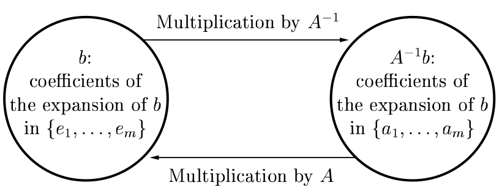

# Chapter I. Fundamentals

Matrix columns are images of unit basis vectors, i.e. $M = [M \mathbf{e_1}, M \mathbf{e_2}, ... M \mathbf{e_m}]$ . 
This is analogous to a 3D vector being composed of $\mathbf{i}$, $\mathbf{j}$ and $\mathbf{k}$ with coefficients.

## Matrix times Vector

Vectors are special cases of Matrices:
- Column Vector $\mathbf{u}$: $m \times 1$ matrix: $\mathbf{u} = \begin{bmatrix} u_1 \\ u_2 \\ \vdots \\ u_m \end{bmatrix}$
- Row Vector $\mathbf{v}$: $1 \times n$ matrix: $\mathbf{v}^\top = \begin{bmatrix} v_1 & v_2 & \cdots & v_n \end{bmatrix}$

NOTE: vector dot product is special case of matrix multiplication: row vector with $1 \times n$ shape, into column vector with $n \times 1$ shape, becomes scalar $1 \times 1$.

* Every linear map / transformation (ie polynomial $p(\mathbf{x})$) from $\mathbb{C}^n$ to $\mathbb{C}^m$ is expressible as multiplication (of coefficients vector $\mathbf{c}$) with $m \times n$ **Vandermonde matrix** ($m$ rows, $n$ columns):

$$
A =
\begin{bmatrix}
1 & x_1 & x_1^2 & \cdots & x_1^n \\
1 & x_2 & x_2^2 & \cdots & x_2^n \\
\vdots & \vdots & \vdots & \ddots & \vdots \\
1 & x_n & x_n^2 & \cdots & x_n^n
\end{bmatrix}
=
\begin{bmatrix}
\mathbf{1} & \mathbf{x} & \mathbf{x}^2 & \cdots & \mathbf{x}^n
\end{bmatrix}
$$

Column vector $\mathbf{c}$ represents polynomial coefficients:

$$\mathbf{c} = \begin{bmatrix} c_1 \\ c_2 \\ \vdots \\ c_m \end{bmatrix}$$

So mapping (matrix * vector multiply) $A \mathbf{c}$ can be understood as a single vector summation: 

$$ p(\mathbf{x}) = A \mathbf{c} = c_0 + c_1 \mathbf{x} + c_2 \mathbf{x}^2 + \cdots + c_n \mathbf{x}^n $$

* Special casing matrix times matrix $A$ (having row vectors $\mathbf{r_1}$) by taking second matrix (here column vector $\mathbf{x}$):
$$
\begin{bmatrix} \mathbf{r_1} \\ \mathbf{r_2} \\ \vdots \\ \mathbf{r_n} \end{bmatrix}
\begin{bmatrix} x_1 \\ x_2 \\ \vdots \\ x_n \end{bmatrix} =
\begin{bmatrix} x_1 \mathbf{r_1} \\ x_2 \mathbf{r_2} \\ \vdots \\ x_n \mathbf{r_n} \end{bmatrix}
$$

If $A$ is a diagonal matrix, then we get:

$$
\begin{bmatrix}
a_1    & 0      & \cdots & 0 \\
0      & a_2      & \cdots & 0 \\
\vdots & \vdots & \ddots & \vdots \\
0      & 0      & \cdots & a_n
\end{bmatrix}
\begin{bmatrix} x_1 \\ x_2 \\ \vdots \\ x_n \end{bmatrix} =
\begin{bmatrix} a_1 x_1 \\ a_2 x_2 \\ \vdots \\ a_n x_n \end{bmatrix}
$$

## Matrix times Matrix

Matrix multiplication $B = A C$ can be written in terms of column vectors of B, A, and row vectors of C.
$\mathbf{b_j}$ (column) is a linear combination of columns $\mathbf{a_k}$ with coefficients $c_{kj}$ :

$$
\begin{pmatrix}
\mathbf{b}_1 & \mathbf{b}_2 & \cdots & \mathbf{b}_n
\end{pmatrix}
=
\begin{pmatrix}
\mathbf{a_1} \\
\mathbf{a_2} \\
\vdots \\
\mathbf{a_m}
\end{pmatrix}
\begin{pmatrix}
\mathbf{c_1} & \mathbf{c_2} & \cdots & \mathbf{c_m}
\end{pmatrix}
=
\begin{pmatrix}
A \mathbf{c_1} & A \mathbf{c_2} & \cdots & A \mathbf{c_m}
\end{pmatrix}
$$

Another representation of $B = A C$ (where $B$ is $m \times n$, $A$ is $m \times k$, $C$ is $k \times n$):

$$
\begin{bmatrix}
\mathbf{r_1} \cdot \mathbf{c_1} & \mathbf{r_1} \cdot \mathbf{c_2} & \ldots & \mathbf{r_1} \cdot \mathbf{c_n} \\
\mathbf{r_2} \cdot \mathbf{c_1} & \mathbf{r_2} \cdot \mathbf{c_2} & \ldots & \mathbf{r_2} \cdot \mathbf{c_n} \\
\vdots & \vdots & \ddots & \vdots \\
\mathbf{r_m} \cdot \mathbf{c_1} & \mathbf{r_m} \cdot \mathbf{c_2} & \ldots & \mathbf{r_n} \cdot \mathbf{c_n}
\end{bmatrix}
= \begin{bmatrix} \mathbf{r_1} \\ \mathbf{r_2} \\ \vdots \\ \mathbf{r_m} \end{bmatrix} \begin{bmatrix} \mathbf{c_1} & \mathbf{c_2} & \ldots & \mathbf{c_n} \end{bmatrix}
$$

Special Cases:

* **Outer Product** of $m \times 1$ column vector/matrix $\mathbf{u}$ with $1 \times n$ row vector/matrix $\mathbf{v}$:

$$
\begin{bmatrix}
u_1 \\
u_2 \\
\vdots \\
u_m
\end{bmatrix}
\begin{bmatrix}
v_1 & v_2 & \cdots & v_n
\end{bmatrix}
=
\begin{bmatrix}
v_1 u_1 & v_2 u_1 & \cdots & v_n u_1 \\
v_1 u_2 & v_2 u_2 & \cdots & v_n u_2 \\
\vdots & \vdots & \ddots & \vdots \\
v_1 u_m & v_2 u_m & \cdots & v_n u_m
\end{bmatrix}
$$

* Consider $B = A R$ where R is a *unit upper triangular matrix* (below main diagonal 0s, rest 1s).

$$
\begin{bmatrix}
\mathbf{b}_1 & \mathbf{b}_2 & \dots & \mathbf{b}_n
\end{bmatrix}
=
\begin{bmatrix}
\mathbf{a}_1 & \mathbf{a}_2 & \dots & \mathbf{a}_n
\end{bmatrix}
\begin{bmatrix}
1 & 1 & \dots & 1 \\
0 & 1 & \dots & 1 \\
\vdots & \vdots & \ddots & \vdots \\
0 & 0 & \dots & 1
\end{bmatrix}
$$

That is, $b_j = A r_j = \sum_{k=1}^j A_k$ --- *j'th column of $B$ is sum of first $j$ columns of $A$*. 
Here $R$ is **Discrete Analogue of Indefinite Integral Operator** (TODO: check what exactly this means).

## Range (Column Space) and Null Space

* *Range / Column Space* of matrix is space of all linear combinations of column vectors: $\mathbf{y} = A \mathbf{x}$ .
* *Null Space* is space of vectors $x$ that satisfy $A \mathbf{x} = 0$ .

## Rank

Rank is no. of independant column / row vectors. A *full rank* matrix of $m \times n$ (where all vecs linearly independent) has rank $min(m, n)$ .

## Inverse

*Invertible / Non-singular* matrix is a square matrix of full rank - columns form basis vectors, any vector can be written as linear combination of them.
Such a matrix has unique inverse such that $A A^{-1} = I$ . Note that identity matrix $I$ is made of unit basis vectors in columns.

For such a matrix $A \in \mathbb{C}^m$ (i.e., A has shape $m \times m$), following are also true:
* $rank(A) = m$
* $range(A) = \mathbb{C}^m$
* $null(A) = \{0\}$ . TODO CHECK: isn't null space usually written excluding 0 vector, so this should be empty set ?
* 0 is NOT an eigenvalue of A
* 0 is NOT a singular value of A -- TODO: check what is singular value
* $det(A) \neq 0$

## Matrix Inverse times Vector

$\mathbf{x} = A^{-1} \mathbf{b}$ means find unique vector $\mathbf{x}$ such that it solves linear equations $A x = b$. 
So *$A^{-1} \mathbf{b}$ is the vector of coefficients of expansion of $\mathbf{b}$ in the basis of columns of $A$ .* --- TODO: reread and understand this!
This is a **change of basis** operation:

## Exercise Solutions of Chapter 1

NOTE: exercise jupyter notebooks are best viewed in its native browser UI, NOT in vscode (in vscode, notebook's output isn't showing in monospace, causing ugly render of numpy array).

TODO: unverified answers; check if book has given solutions to problems.

* [Exercise 1.1](solutions/exercise1.1.ipynb)
* **Exercise 1.1**:
    * (a) 
    $$
    K = \begin{bmatrix}
        -k_{12} & k_{12}  & 0       & 0 \\
        0       & -k_{23} & k_{23}  & 0 \\
        0       & 0       & -k_{34} & 0
    \end{bmatrix} \\
    \mathbf{f} = K \mathbf{x} - \begin{bmatrix} l_1 k_{12} & l_2 k_{23} & l_3 k_{34} \end{bmatrix}
    $$
    * (b) Dimensions of $K$ (in physics sense) = $\frac{mass}{time^2}$
    * (c) Dimensions of $det(K)$ (in physics sense) = $\frac{mass^3}{time^6}$
    * (d) $\frac{grams}{seconds^2} = 0.001 \frac{kg}{seconds^2}$, so $K' = 0.001 K$ and $det(K') = 10^{-6} det(K)$
* *Exercise 1.3*: proof required, skipped
* *Exercise 1.4*: proof required, skipped