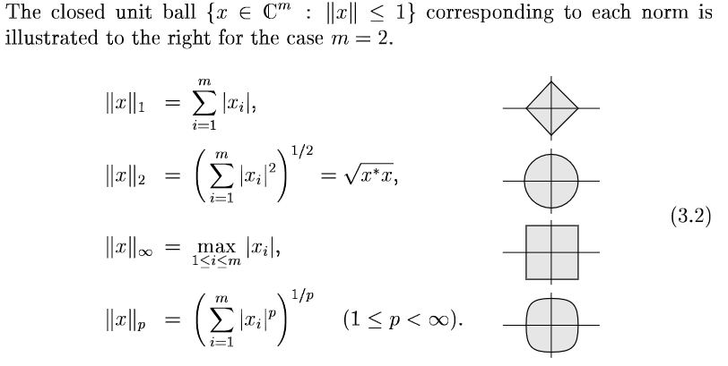
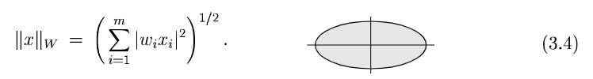
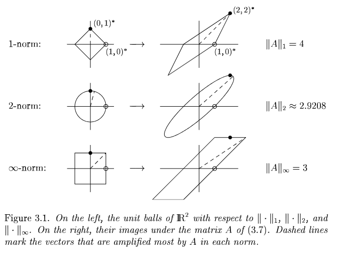
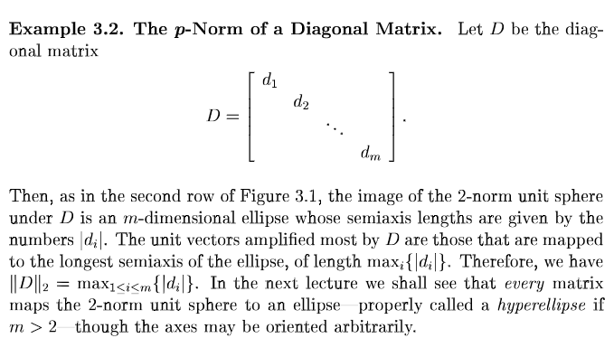

# Part 1, Lecture 3 - Norms

## Vector Norms

A norm is a function $ \| . \| : \mathbb{C}^m \rightarrow \mathbb{R} $ that converts vector to real distance satisfying conditions:

* norm of non-zero vector is positive: $\|\mathbf{x}\| \ge 0$ - and $ \|\mathbf{x}\| = 0$ only if $\mathbf{x} = 0$
* *triangular inequality*: $\|\mathbf{x} + \mathbf{y}\| \le \|\mathbf{x}\| + \|\mathbf{y}\|$
* scaling a vector scales its norm by same amount: $\| \alpha \mathbf{x} \| = |\alpha| \|\mathbf{x}\|$

Most important class of vector norms is $p$-norms (also called L-norms) (2-norm is Euclidean length; its unit ball is a circle):

Next most important class is *weighted $p$-norms* (each coordinate axis is given its own weight).
It can be defined in terms of standard norm:

$$\|\mathbf{x}\|_W = \| W \mathbf{x} \|$$

where $W = diag(w_1, w_2, \cdots w_m)$ is diagonal matrix with non-zero diagonal weights $w_i$.
For example, weighted 2-norm $\|.\|$ on $\mathbb{C}^m$ is:

*Most important are unweighted 2-norm (euclidean) and its induced matrix norm.*

## Matrix Norms Induced by Vector Norms

Norm on matrix $A (m \times n)$ is the minimum number $c$ that satisfies:

$$\forall x \in \mathbb{C}^n, \|A \mathbf{x}\|_{(m)} \le c \|\mathbf{x}\|_{(n)}$$

A matrix norm $\|.\|_{(m,n)}$, induced by vector norms $\|.\|_{(m)}$ and $\|.\|_{(n)}$, 
is the maximum by factor which $A$ can "stretch" any vector $\mathbf{x}$ .

In terms of *images* of unit vectors under $A$ (NOTE: image of vector $\mathbf{x}$ under matrix $A$ simply means product $A \mathbf{x}$):

$$\forall \mathbf{x} \in \mathbb{C}^n, \mathbf{x} \ne 0, \|A\|_{(m,n)} = max \frac{ \|A \mathbf{x}\|_{(m)} } { \|\mathbf{x}\|_{(n)} }$$

But magnitude of unit vector is 1, so:

$$\|A\|_{(m,n)} = max \|A \mathbf{x}\|_{(m)}$$

### Example 3.1 - Different Induced Matrix Norms

For:

$$A = \begin{bmatrix}1 & 2 \\ 0 & 2\end{bmatrix}$$

IMPORTANT: these plots are because $A$ is 2x2 matrix; for $m \times m$ matrices, similar plots would be in $m$-dimensional space:

Here:

* In all the norms, $A$ maps $\mathbf{e_1} = \begin{pmatrix}1 & 0\end{pmatrix}^*$ to first column of $A$ 
$\begin{pmatrix}1 & 0\end{pmatrix}^*$ (here equal to $\mathbf{e_1}$ itself!) and $\mathbf{e_2}$ to
second column of $A$ $\begin{pmatrix}2 & 2\end{pmatrix}^*$ .
* In 1-norm, unit vector $\begin{pmatrix}0 & 1\end{pmatrix}^*$ (or its negative) is amplified most (by $4$).
* In $\inf$-norm, unit vector $\begin{pmatrix}1 & 1\end{pmatrix}^*$ (or its negative) is amplified most (by $3$).
* In 2-norm, unit vector indicated by dashed line in figure is amplified most, by approx 2.9208 . Explanation for this is in [Lecture 5](Lecture5.md) .

### Example 3.2 - p-norms of Diagonal Matrix

For diagonal matrix $D$ having $d_1, d_2 \cdots d_m$ values on main diagonal, $\|D\|_p = max |d_i|$ -- **NOTE in this case answer is independent of $p$ !**

### Example 3.3 - 1-norm of a matrix

It's equal to "maximum column sum" of $A$ -- each column sum is sum of absolute values of the column.

### Example 3.4 - $\inf$-norm of a matrix

It's equal to "maximum row sum" of matrix $A$.

### Cauchy-Schwarz and Holder Inequalities

TODO

## Exercises on Lecture 3

* *Exercise 3.1*: Generalize vector weighted p-norm to use $W$ as any non-singular matrix, not necessarily diagonal.
  TODO

