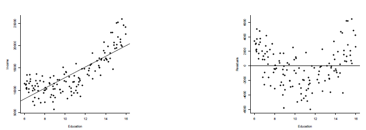
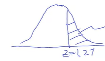
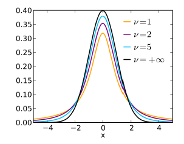

# Statistics Notes
Notes from course [Intro to Statistics by Stanford](https://www.coursera.org/learn/stanford-statistics). All material from the course is in OneDrive folder "Stanford-Statistics-Course-Slides".

**TODO:** Failed quiz of [Module 3](#probability) mainly due to Bayes' Formula wrong answer - try it again.

**Probability Density of Continous Data**: In a continous probability historgram, absolute probability at any single point is 0, since there are infinite number of points. So we instead use Probability Density, which is probability per unit length.

Appropriate tests for comparing 2 variables:

_           | Categorical | Numerical   |
----------- | ----------- | ----------- |
Categorical | Chi-Squared | ANOVA       |
Numerical   | ANOVA       | Correlation |

### Variance Formula

$$Variance = \sigma^2 = \frac{\sum (x - \bar{x})^2}{n}$$

where $\bar{x}$ is the Mean, $\sigma$ is Standard Deviation, $N$ is no. of observations.

It can also be restated in terms of Expected Value:

$$Variance = \sigma^2 = E[x^2] - E[x]^2$$

$$WeightedVariance = \sigma^2 = \frac{\sum (x - \bar{x})^2 \cdot w_x}{\sum w_x}$$

where $w_x$ is the weight corresponding to each x.

## Descriptive Statistics
Purpose:
- Communicate info
- Support reasoning

### Data Visualization
Discrete Data:
- Pie Chart & Bar Graph (discrete data frequencies), Scatter Plot (for 2D data)
- Dot Plot: bar graph put on its side (Y,X <- classes, frequencies) with dots instead of bars:


- Variable Width Histogram: $BarArea = Frequency$  (relative frequency can also be used)
    - Bar width = size of range (all bars have different sized ranges)
    - $BarHeight = Density = Frequency / BarWidth$


- Boxplot / Box-and-Whisker Plot: shows (in order): min, 25% percentile (1st quartile), median, 75% percentile (3rd quartile), max


Boxplots are compact so allow easily comparing multiple datasets - eg. boxplots of weather for multiple days:


**Data Visualization Pitfalls**: Many sophisticated plots can look visually appealing but be misleading & make data hard to interpret - eg. a 3D perspective bar graph where 3D volume of bars is shown but in fact volume isn't relevant at all (only bar's height is), and also 0 of each bar is at a different level making the plot hard to understand.

### Numerical Measures
- In a symmetric histogram, Mean = Median. But when histogram is very skewed, Median is preferred (Mean is much smaller or larger than Median).
- **Interquartile Range** measures how spread the data is: *3rd quartile (25% percentile) - 1st quartile (75% percentile)*
- Mean, Std. Deviation are both sensitive to a few small / large outliers. If that's a concern, use Interquartile Range instead.


## Producing Data and Sampling
While making a sample (to make inferences about population based on sample), avoid biases:
- *Selection Bias*: Sample of Convinience - eg. sample of people from hometown is a poor representative of whole country
- *Non-Response Bias*: parents less likely to respond to surveys at 6pm because busy with children
- *Voluntary-Response Bias*: people with very good or very bad experiences are much more likely to leave reviews.

Sampling Designs:
- *Simple Random Sample*: Random without Replacement
- *Stratified Random Sample*: Divide population into strata (eg. based on income), then draw from each using simple random.

$$Estimate = Actual + Bias + Chance/Sample Error$$

where:
- Chance/Sample Error gets smaller as sample size increases. Changing sample changes this error value.
- But bias isn't eliminated by increasing sample size.

An *Observational Study* may find a correlation between 2 things, but to estabilish causation a **Randomized Control Experiment** needs to be done:
- *Control* group gets placebo, *Treatment* group gets actual treatment - the groups should be otherwise identical.
- *Double-Blind experiment*: Neither subjects nor evaluators should know who is in which group.


## Probability
If A and B are mutually exclusive events, then:
- P(A or B) = P(A) + P(B)
- P(A and B) = P(A) P(B)

Conditional Probability: $P(B|A) = \frac{P(A and B)}{P(A)}$

Bayes' Rule: $P(B|A) = \frac{P(A|B) P(B)}{P(A)} = \frac{P(A|B) P(B)}{P(A|B) P(B) + P(A|~B) P(~B)}$


## Normal Approximation for Data & Binomial Distribution
*Three Sigma Rule*: In Normal Distribution:
- 68% (about 2/3) data falls within one standard deviation from mean
- 95% in 2 standard deviations
- 99.7% in 3 standard deviations

**Z-Score / Standardized Value**: Using $\bar{x}$ as Mean, $s$ as Standard Deviation:

$$z1 = \frac{x1 - \bar{x}}{s}$$ 

Z Score has no units. $z = 2$ means x is 2 standard deviations above average. $z = -3$ means x is 3 standard deviations below average. *Y axis (frequency count) has no role in calculating Z Score*.

This standard value forms a **Standard Normal Curve** with mean 0, variance 1:


### Normal Approximation
Estimating area under an approx normal curve.

A [*Z Table / Normal Table*](https://z-table.com/) tells the *percentile area* to the left of a Z Score.

To find area between points $x1$ and $x2$ on a normal curve:
- Calc Z Scores: $z1 = \frac{x1 - \bar{x}}{s}$, $z2 = \frac{x2 - \bar{x2}}{s}$
- Lookup percentile values for these Z Scores using Z Table: $p1$ % and $p2$ %.
- Find *percentile area*: $(p2-p1)$ %.

*X (given percentile)*: $x1 = \bar{x} + z1 \times s$

### Binomial Probability
Binomial Probability is ${}^n \mathrm{ C }_k p^k (1-p)^{n-k}$ where $p$ is the probability of success and $n$ is the no. of independant experiments. 

Binomial Coefficient is: ${}^n \mathrm{ C }_k = \frac{n!}{k! (n-k)!}$

The no. of successes $X$ is a **Random Variable** and has the Binomial Distribution. Probabilities of various $X$ can be visualized with a **Probabilistic Histogram**:


#### Approximating Binomial Probab with Normal Distribution
As $n \to \inf$, the binomial probability distribution approaches normal distribution. We can use this to approximate Binomial Probability of at most $x$ successes with [Normal Approximation](#normal-approximation) using approx mean $\bar{x} = np$, std. dev. $s = \sqrt{np(1-p)}$. These formulae are derived [using Central Limit Theorem](#deriving-normal-probability-distribution-formulae).

**Example**: If p = P(win a small prize) = 0.2, we play n = 50 times. What is P(at most 12 small prizes) ?
- Mean $\bar{x} = np = 50 \times 0.2 = 10$
- Std. Dev. $s = \sqrt{np(1-p)} = \sqrt{50 \times 0.2 \times (1-0.2)} = \sqrt{8} \approx 2.8$
- Z Score $z = \frac{x - \bar{x}}{s} = \frac{12 - 10}{2.8} \approx 0.71$
- P(at most 12 small prizes) = 0.7611 (by looking up 0.71 in [Z Table](https://z-table.com/))

**Simple Random Sample**: Sampling Without Replacement: It's not same as Binomial Probability because probability $p$ changes after each experiment. But if $n >> k$, then we can approximate it as Binomial Probability (& therefore Normal Distribution).


## Sampling Distributions and Central Limit Theorem
Estimating Population characterstics based on Sample:
- *Parameter*: what we want to estimate - population mean $\mu$, std. dev. $\sigma$
- *Statistic (estimate)*: sample characterstic based on which we want to estimate population characterstic - sample mean $\bar{x}$, std. dev. $s$

**Standard Error (SE)** tells us how far away a statistic will be from its *Expected Value*. It's simply the standard deviation of the statistic.

**Expected Value of 1 random draw**: population mean $\mu$ (give or take population std. dev. $\sigma$)

### Drawing multiple times 
We draw from population $n$ times. Standard Error becomes smaller if we use a larger sample size $n$ - it  doesn't depend on size of population, only sample size. *Standard Error of a statistic is simply Standard Deviation of the statistic.*

#### Mean of n draws
- Expected Value $E[\bar{x_n}]$ = population average $\mu$
- Standard Error $SE[\bar{x_n}] = \frac{\sigma}{\sqrt{n}}$

#### Sum of n draws
- Relation to mean: $S_n = n \bar{x_n}$
- Expected Value $E[S_n] = n \mu$
- Standard Error $SE[S_n] = \sqrt{n} \sigma$ - so variability of sum of $n$ draws increases at rate $\sqrt{n}$.

### Expected Value & Standard Error for Percentages
A question like "what % of voters voted in election" is asking for the mean.
- assign 1 to all voters who voted, 0 otherwise
- then no. of voters who voted = sum of counts of all voters $S_n$
- Question becomes: what % of labels are 1s = $\frac{S_n}{n} \times 100\%$
- Expected Value $E[\%Of1s] = \mu \times 100\%$ where $\mu$ is the population average - i.e., what % are 1s
- Standard Error $SE[\%Of1s] = \frac{\sigma}{\sqrt{n}} \times 100\%$ where $\sigma$ is std. dev. of population of 1s and 0s

Above 2 formulae (expected error & standard error) are for Sample with Replacement, but we can use them for Sample without Replacement if sample size is much smaller than population size.

#### Using Probability Histogram
The above formulae still apply when the values are **simulated** (generated from a probability histogram):
- Discrete data:
    - Mean is weighted avg (where weights are probabilities): $\mu = \sum x \cdot P(x)$ where $P(x)$ is probability of a given x.
    - Variance is weighted variance (first see [variance formula](#variance-formula)): 
    $\sigma^2 = \sum (x - \mu)^2 \cdot P(x)$
- Continous data: in terms of probability density $f(x)$:
    - Mean $\mu = \int_{-\infty}^{\infty} x \cdot f(x) \, dx$
    - Variance $\sigma^2 = \int_{-\infty}^{\infty} (x - \mu)^2 \cdot f(x)$

#### Example
- **Question**: If a fair coin is tossed 100 times, how many tails would you expect, give or take how much?
- **Answer**: Discrete data (2 values: Head, Tail), $n=100$ repetitions of fair coin with probability $p = P(Tail) = 1/2$
    - For each coin toss, treat Tail as 1, Head as 0.
    - Mean $\mu = \sum x \cdot P(x) = 0 \cdot 1/2 + 1 \cdot 1/2 = 1/2$
    - Variance $\sigma^2 = \sum (x - \mu)^2 \cdot P(x) = (0 - 1/2)^2 \cdot 1/2 + (1 - 1/2)^2 \cdot 1/2 = 1/4$
    - Standard Deviation $\sigma = \sqrt{1/4} = 1/2$
    - Expected Value $E(S_n) = n \cdot \mu = 100 \cdot 1/2 = 50$
    - Standard Error $SE(S_n) = \sqrt{n} \cdot \sigma = \sqrt{100} \cdot 1/2 = 5$
    - **So we expect 50 tails, give or take 5.**
    - $SE(S_n)$ is simply standard deviation of $S_n$, so if this experiment were to be repeated many times, no. of tails would be between 45 and 50 (i.e., one standard deviation from mean) 68% of the time.

### Sampling Distribution
If statistic of interest is no. of tails $S_n$, then $S_n$ is a random variable whose probability distribution is given by the binomial distribution. This is called **Sampling Distribution**.

3 historgrams in Sampling Distribution:
- Probability Histogram of each coin toss:


- *Emperical Histogram* of no. of 100 observed tails (real data):


- **Population Histogram**: Probability Histogram of statistic $S_{100}$ (no. of tails):


NOTE: If we just say "Sampling Distribution histogram", then we mean Probability Histogram of the sample statistic we're looking at.

**Law of Large Numbers**: As sample size $n$ approaches population size $N$, sample mean $\bar{x}$ approaches population mean $\mu$:

$$\lim_{n \to N} \bar{x} = \mu$$

Law of Large Numbers applies to averages and percentages, **but doesn't apply to sums** as sums *increase* with size. It applies to Sampling with Replacement - **it won't work for Sample Without Replacement for large sample size (wrt population size)**.

*Advanced Law of Large Numbers*: As sample size grows larger, its emperical histogram approaches population's histogram.

### Central Limit Theorem
Sampling with Replacement: As no. of independant events $n$ gets larger, Binomial Probability approaches Normal Curve.

So when Sampling with Replacement and large sample size, probability histogram of sample statistic (avg / sum) approaches Normal Curve with mean as Expected Value, std. deviation as Standard Error.

**Sampling statistic's probability distribution is Normal, irrespective of Population Histogram**.

#### Deriving Normal Probability Distribution formulae
Recall that in [Exp. Val & Std. Error for Percentages](#expected-value--standard-error-for-percentages),
we created a distribution with values only 1s and 0s (1 if condition is met, 0 otherwise).

Let $Y_i$ be the result of a single binomial experiment - its value is either 0 or 1. Its probability of success (1) is $P(Y_i) = p$.
- Mean $E[Y_i] = 0 \cdot (1-p) + 1 \cdot p = p$
- Variance:
    - $Var[Y_i] = E[Y_i^2] - E[Y_i]^2$
    - Since $Y_i$ only takes 2 values 0,1, therefore $E[Y_i^2] = E[Y_i]^2 = p$
    - So $Var[Y_i] = p - p^2 = p(1-p)$

Let random variable $X$ be the Binomial Probability after $n$ experiments. Using Central Limit Theorem, $X$ is normally distributed for large $n$.

So from above, we get the formulae mentioned in [Approximating Binomial Probab with Normal Distribution](#approximating-binomial-probab-with-normal-distribution) using [Sum of n draws formulae](#sum-of-n-draws):
- Expected Value of Binomial Probab $E[X] = n \cdot E[Y_i] = np$
- Standard Error of Binomial Probab $SE[X] = \sqrt{n} \cdot \sigma_X = \sqrt{np(1-p)}$

#### Requirements for applying Central Limit Theorem
For normal approximation to work, requirements are:
- Either Sample with Replacement, or simulate independant variables from same distribution.
- Statistic of interest is a sum (average and percent are sums in disguise).
- Larger the skew in population histogram, larger the required sample size $n$. 
  If there's no skew, $n \ge 15$ is ok.


## Linear Regression (1 input variable)
Best predictor of a random variable $X$ is its average $\bar{x}$. But if its relation with a different variable is known, then regression can be used to give a better predictor.

Scatter-plot of relation between 2 variables may have:
- *direction*: sloping up / down
- *form*: eg. linear
- *strength*: how closely do points follow the form?

*Explanatory Variable / Predictor* is placed on X axis, *Response Variable* on Y axis.

Linear **Correlation Coefficient** $r \in [-1,1]$ measures strength of linear correlation using Z Scores $z_x$, $z_y$:

$$r = E[z_x \times z_y] = \frac{1}{n} \sum \frac{x_i - \bar{x}}{s_x} \times \frac{y_i - \bar{y}}{s_y}$$

Sometimes standard deviations $s_x$ and $s_y$ are calculated by dividing with $n-1$ instead of $n$ - in that case, divide by $n-1$ here also.

Correlation Coefficient $r$ has no units and is not affected by scaling or shifting.

### Least Squares Method
We're looking for a line $y_i = m \cdot x_i + c$ that minimizes **Mean Squared Error (MSE)**:

$$MSE = E[(y_i - \^{y_i})^2] = E[(y_i - (m \cdot x_i + c))^2]$$

where $y_i$ is observed val, $\^{y_i}$ is true val.

**Regression Line** that minimizes MSE is $y = m \cdot x + c$ where:
- slope $m = r \frac{s_y}{s_x}$
- intercept $c = \bar{y} - m \cdot \bar{x}$

**Regression to Mean**: Std. Dev. of predicted val $\^{y}$ is less than Std. Dev. of input $x$. This is also called *Regression Effect*. So with enough experiments, top $y$ tends to reduce towards mean (and bottom ones tend to increase towards mean). **Regression Fallacy** is wrongly assuming that this is due to some other reason (eg. assuming that top-scorers' scores reduced in re-test because they slacked off).

If a line is trained to predict $y$ from $x$, but we instead use it to predict $x$ from $y$, this will give wrong results and is called **Regression Fallacy**. For predicting $x$ from $y$, invert axes and then re-train as mentioned above.

### Normal Approximation in Regression
Linear Regression requires that the scatter plot of X and Y variables be *football-shaped*:


The known $y$ observations near an input $x$ approximately follow a normal curve 
centered on predicted $\^{y}$ and having Std.Dev. $\sqrt{1-r^2} \times s_y$.

**Example**: 
- *Question*: We're predicting final exam scores $y$ of students based on their midterm scores $x$.
    1. Predict the final exam score of a student who scored 41 on the midterm. 
    2. Among the students who scored around 41 on the midterm, what percentage scored above 60 on the final?
- *Given*: $\overline{midterm} = 49.5$, $\overline{final} = 69.1$, $s_{mid} = 10.2$, $s_{final} = 11.8$, $r = 0.67$
- *Solution:*
```python
>>> ax, ay, sx, sy, r = 49.5, 69.1, 10.2, 11.8, 0.67    # ax,ay <- Averages of X,Y; sx,sy <- Std.Dev. of X,Y
>>> slope = r * sy / sx
>>> intercept = ay - slope * ax
>>> print(f'Regression Line: y = {slope:.3f} x + {intercept:.3f}')
Regression Line: y = 0.775 x + 30.733

>>> x = 41
>>> ypred = slope * x + intercept
>>> print(f'For {x=}, predicted {ypred=:.3f}')      # answer to part 1 of question
For x=41, predicted ypred=62.512

>>> ystd = math.sqrt(1-r**2) * ypred
>>> print(f'Around {x=}, y values approximate a normal curve centered on {ypred=:.3f} with spread {ystd:.3f}')
Around x=41, y values approximate a normal curve centered on ypred=62.512 with spread 46.406

>>> yquery = 60
>>> zscore = (yquery - ypred) / sy
>>> zprobab = scipy.stats.norm.cdf(zscore)       # Lookup probab (< yquery) in Z Table
>>> print(f'{zscore=:.3f}; Around {x=}, P(y < {yquery}) = {zprobab:.1%}')
>>> print(f'Final Answer: Around {x=}, P(y > {yquery}) = {1-zprobab:.1%}')    # answer to part 2 of question
zscore=-0.213; Around x=41, P(y < 60) = 41.6%
Final Answer: Around x=41, P(y > 60) = 58.4%
```

### Residuals
Residuals are the difference between actual and predicted values: 

$$e_i = y_i - \^{y_i}$$

Residuals are used to check whether use of Linear Regression is appropriate. **Residual Plot** is a Scatter Plot of residuals against $x$ values.

Residual Plot should be *an unstructured horizontal band* (**homoscedastic**):


OTOH *any kind of curve in Residual Plot is bad*  - curved plots indicates the scatter isn't linear:



If Residual Plot is curved, we may still be able to use Regressioni after Transformations - eg. applying $log$ or $sqrt$ to an axis (or both axes, if transform on just one axis results in non-linear residual scatter plot).

Another violation of "Football-Shaped" assumption in Linear Regression is **heteroscedastic** residual plot (where variance / distance of points from x axis increases or decreases with x value):


**Outliers** are points with very large residuals - these should be seperately examined.

A point whose x-value is far from the mean of the x-values has **high leverage**: it has
the potential to cause a big change the regression line. Whether it does change the line a lot (**influential point**) or not can only be determined by refitting the regression without the point. *An influential point may have a small residual (because it is influential!)*, so a residual plot is not helpful for this
analysis.

### More Issues to Avoid in Regression
- Avoid *extrapolation*: predicting $y$ outside the $x$ range where Regression was trained.
- Beware of data that are summaries (eg. averages of some data). These are less variable than original data and correlation between averages tends to overstate actual relation of data.
- **R-Squared** $r^2$ is often reported in Regression - it's the fraction of values in the Y axis that can be explained by Regression Line. So $1 - r^2$ is the fraction of variation in Y axis that's left in the residuals.


## Confidence Intervals
Suppose sample average is 0.58, Standard Error SE is 0.0016. By Central Limit Theorem, there's a 95% chance the population average is within 2 SEs, i.e., $[0.548, 0.612]$ is a **95% confidence interval** for population average (it's default - if not mentioned explicitly, 95% confidence interval is understood).

So Confidence Interval is $estimate \pm z SE$ where $z$ is Z Score corresponding to desired Confidence Interval:
- 95% confidence level ==> z = 1.96
- 90% confidence level ==> z = 1.65
- 99% confidence level ==> z = 2.58

For averages (eg. percentages), $SE = \frac{\sigma}{\sqrt{n}}$. We don't know $\sigma$, but **Bootstrap Principle** states that we can approximate population Std.Dev. $\sigma$ can be estimated by sample Std.Dev. $s$ to still get approx confidence interval.

**Margin of Error** (width of confidence interval) is $z SE$. It can be reduced by:
- increasing sample size $n$, since $SE = \sigma / \sqrt{n}$
- reduce confidence (eg. 95% -> 80%) - this decreases $z$ but also decreases confidence precision.

For binary distibution ($y$ has values 0 or 1, eg. what % of people voted in election), Margin of Error for 95% confidence interval can be approximated using % calculated with a sample:

$$SamplePercent \pm \frac{1}{\sqrt{n}}$$

This is because $\sigma = \sqrt{p(p-1)} \le 1/2$ for any probability $p$.


## Test of Significance / Hypothetisis Testing
Hypothesis Testing tests statistical sample results to check whether a statistical result is significant:
- **Null Hypothesis** $H_0$ is basically "nothing extraordinary is going on" (eg. fair coin)
- **Alternate Hypothesis** $H_A$ is opp. of Null Hypothesis - says different chance process generated the data (eg. biased coin, i.e., P(Tail) != 1/2).

Hypothesis Testing involves collecting data and evaluating whether to **reject Null Hypothesis**.

**Test Statistic** measures how far away observed data is from data expected if Null Hypothesis $H_0$ was true.

### Z Test
Most common test statistic is **Z Statistic**:

$$z = \frac{observed - expected}{SE}$$

Large Values of $|z|$ are **evidence** against Null Hypothesis $H_0$. Strength of evidence is measured by **p-value / observed significant level**. P Value is the probability (assuming Null Hypothesis $H_0$ is true) of finding a statistic that is as or more extreme than the current statistic. Note that P Value *doesn't give* probability of $H_0$ - it's either true or not, there's no chance involved.

A result is **statistically significant** (i.e., we can reject Null Hypothesis) when P Value < 5% - here 5% is the **significance level**.

Usually we're interested in *Two-Sided P Value* (i.e., considering area outside bounds of both $z$ and $-z$):


But sometimes *One-Sided P Value* is also used:



### T Test
When sample size is small $n < 20$, then the statistic can't be approximated as a normal curve. Instead we use the distribution **Student’s t-distribution with n - 1 degrees of freedom**:



We approximate population standard deviation $\sigma$ like this (dividing by $n-1$ instead of $n$ to account for additional uncertainity):

$$s = \sqrt{\frac{\sum (x_i - \bar{x})^2}{n-1}}$$

After that Z Test is continued as before. We should also use T Statistic instead of $z$ while calculating 95% Confidence Interval:

$$Estimate \pm t_{n-1} * SE$$

Note that *statistically significant* doesn't necessarily mean that the effect size is important. That's why we usually also report 95% Confidence Interval along with P Value. A 95% Confidence Interval contains all the values that are NOT statistically significant (using two-sided P Value).

[T Table](https://www.ttable.org/) is used to look up P Value:
- First look up row no. corresponding to degrees of freedom $n-1$.
- Now look up column with T Score closest to actual t score. In the table 2 values are given, one for One-Sided and Two-Sided test. If only One-Sided is given, we can get Two-Sided probability by doubling it.
- Finally cell corresponding to this row and column is the P Value.

### Two-Sample Z Test
If percentages in 2 samples $p1$ and $p2$ are independant then:

$$SE(p2 \pm p1) = \sqrt{SE(p1)^2 + SE(p2)^2}$$

Also if Null Hypothesis is that $p1 = p2$ then we can **pool** the samples from both into a single sample and then calculate pooled estimate SE.

**Pooled Standard Deviation**: If we assume that $\sigma_1 = \sigma_2$, then we can estimate standard deviation with a pooled estimate:

$$s_{pooled}^2 = \frac{(n_1 - 1) s_1^2 + (n_2 - 1) s_2^2}{n_1 + n_2 - 2}$$

But advantage of doing this is small and rests on assumption $\sigma_1 = \sigma_2$, so it's usually avoided.

Two-Sample Z Test is applicable when the 2 samples are independant, but can also be used in some special cases even when samples are dependant - eg. control and treatment groups in a Randomized Trial.

If sample sizes $n_1$, $n_2$ are too small, then use T Test instead.

### Paired Difference Test
*Eg.* Do wives tend to be older than husbands? Data: ages of husband-wife pairs. Here Two-Sample Z Test isn't appropriate since husband and wives' ages aren't independant. So instead we simply do a T Test on age differences of *matched pairs* - this is called **Paired T Test**.


## Resampling

### Monte Carlo Method
In cases where Normal Approximation is not applicable for statistics, we can instead do **Simulation / Monte Carlo Method**: Approximate fixed quantity $\theta$ by the average of independant random variables that have expected value $\theta$. By law of large numbers, approximation error can be arbitarily reduced with a large enough sample size. We estimate population parameter $\theta$ with sample **statistic / estimator** 
$\^{\theta}$.

Take 1000 samples, each with 100 samples. Calc $\^{\theta}$ for each sample.

$$SE(\^{\theta}) = \sqrt{E[\^{\theta} - E[\^{\theta}]^2]}$$

Here the 1000 $\^{\theta}$ estimators are not independant, but it can be shown that Law of Large Numbers still applies: 

$$s(\^{\theta}_1, \^{\theta}_2 .. \^{\theta}_n) = \sqrt{\frac{\sum (\^{\theta}_i - avg(\^{\theta}))^2}{n-1}} \approx SE(\^{\theta})$$

Note $n-1$ instead of $n$ in denominator.

### Bootstrap Principle
Pretend sample is population (**plug-in principle**), and resample from this sample to create n samples, then apply Monte Carlo method. Types of Bootstrap are:
- **Non-Parametric Bootstrap** (most common): draw n samples by drawing from replacement from initial sample
- **Parametric Bootstrap**: Assume known distribution (say, normal distribution with unknown mean and std.dev.). Then draw from this distribution using estimators for unknown parameters.
- **Block Bootstrap**: In above, bootstrap samples were drawn independantly. If there is dependence in data (eg. time series), then Block Bootstrap is used.

If sampling distribution of intial sample $\^{\theta}$ is approximately normal, then it's approx $(1-\alpha)$ confidence interval is $\^{\theta} \pm z_{\alpha/2} SE(\^{\theta})$. Eg. when $\alpha = 5%$, then we're finding 95% confidence interval.

But if it's not normal, then we estimate using the histogram of bootstrap samples $\^{\theta}^*$. In the bootstrap histogram, even if it's not normal (eg. skewed like below), we still find the appropriate cutoff points for 95% confidence interval using the midpoint (even though it's not the peak) - that's called **Bootstrap Percentile Interval** 
$[\^{\theta}_{\alpha/2}^*, \^{\theta}_{1-\alpha/2}^*]$:


An alternative is to bootstrap $\^{\theta} - \theta$ instead of $\^{\theta}$ to minimize sensitivity to $\theta$ and produce more accurate confidence interval. This is called **Bootstrap Pivotal Interval** and is given by:

$$[2 \theta - \^{\theta}_{(1-\alpha/2)}^* , 2 \theta - \^{\theta}_{\alpha/2}^*]$$

### Bootstrapping for Regression
We have data $(X_1,Y_1)$,..,$(X_n,Y_n)$ from the simple Linear Regression model:

$$Y_i = a + b X_i + e_i$$

How to estimate standard error and confidence intervals for $a$, $b$ calculated with Least Squares method?

- From data we can compute estimates $\^{a}$ and $\^{b}$.
- Calc error residuals $\^{e_i} = Y_i - \^{a} - \^{b} X_i$
- Resample from these residuals to get $e_1^* , .. , e_n^*$
- Calc bootstrapped responses $Y_i^* = \^{a} + \^{b} X_i + e_i^*$

This gives bootstrap sample $(X_1, Y_1^*)$, .. , $(X_n, Y_n^*)$ from which we can estimate $\^{a}^*$ and 
$\^{b}^*$ using Least Squares method. Now repeat this a 1000 times, then we can estimate SE in a, b with the standard deviations of a, b estimated each time.


## Analysis of Categorical Data

### Test of Goodness of Fit
Check how well do observed numbers for each class match with expected %ages for each class using **Chi-Squared** with Degrees of Freedom $numCategories - 1$:

$$\chi^2 = \sum \frac{(observed - expected)^2}{expected}$$

Here $expected = expectedPercent \times totalSampleSize$.

Large Chi-Squared is evidence against null hypothesis $H_0$. Below is chi statistic graph for 5 degrees of freedom - area to the right of observed chi-squared is the P Value (which can be looked up using a [Chi-Squared Table](https://www.medcalc.org/manual/chi-square-table.php)):


*Chi-Squared Test (multiple categories) is a generalization of a Z Test (2 categories)*.

**Assumption:** Observed data (sample counts) were drawn independantly from a population.

### Test of Homogenity
Tests whether a categorical variable tested on various populations has the same distribution in each population.

An example **Contingency Table** of Titanic survivors in each ticket class:

| _        | First | Second | Third | Crew |
| -------- | ----- | ------ | ----- | ---- |
| Survived | 202   | 118    | 178   | 215  |
| Died     | 123   | 167    | 528   | 698  |

Here this is NOT sample data drawn independantly from a population. Instead we think of each class as independant data - eg. in First class, total 325 are there, so 325 independant draws of 1 (survived) or 0 (died).

Each class has its own probability histogram (of survival). Null Hypothesis is that probability of survival is same for each class - so we can get this probability by calculating for whole population: $p = numSurvived / total$.

So expected survival count per class is $p \times classTotalCount$. Now Chi-Squared is calculated over all 8 cells of table (i.e., both Survived and Died for each class).

Degrees of Freedom is $(numRows - 1) \times (numColumns - 1)$.

### Test of Independence
Test if 2 categorical variables are independant. Calcuation is same as in Test of Homogenity (ticket class vs survived/died).


## One-Way Analysis of Variance (ANOVA)
Check whether a numerical variable behaves similarly for multiple categorical classes. Generalizes *2-sample T Test*. It compares sample variance of means with sample variance within groups.

NOTE: ANOVA compares a Categorical variable and a Numerical variable - it's NOT applicable if both variables are Categorical.

Recall that 2-sample T Test is difference of sample means / SE of difference.

Our example input data is given by these boxplots for 3 classes:


We have $k$ groups, total $N$ nums (considering all groups). Each observation row has mean $\bar{y_j}$, and overall mean is $\bar{\bar{y}}$.

| group 1     | group 2     | ... | group k     |
| ----------- | ----------- | --- | ----------- |
| $y_{11}$    | $y_{12}$    | ... | $y_{1k}$    |
| ...         | ...         | ... | ...         |
| $y_{n_1 1}$ | $y_{n_2 2}$ | ... | $y_{n_k k}$ |

- **Treatment Sum of Squares:** $SST = numRows \sum (\bar{y_j} - \bar{\bar{y}})^2$ has $k-1$ degrees of freedom.
- **Treatment Mean Square:** $MST = \frac{SST}{k-1}$ measures variability of treatment means $\bar{y_j}$.
- **Error Sum of Squares:** $SSE = \sum \sum (y_{ij} - \bar{y_j})^2$ has $N-k$ degrees of freedom.
- **Error Mean Square:** $MSE = \frac{SSE}{N-k}$ measures variability within groups.

**F-Test:** Since we want to compare variability within groups to overall variability, we calculate this ratio:

$$F = \frac{MST}{MSE}$$

Under null hypothesis of equal groups, this ratio should be about 1. It follows a **F-distribution** with $k-1$ and $N-k$ degrees of freedom. Large $F$ is evidence against null hypothesis.

*P Value is area to the right of F score*. It's looked up using an [F Table](http://www.socr.ucla.edu/Applets.dir/F_Table.html) - first look up in column of F Table using degrees of freedom of numerator $k-1$, then in rows using degrees of freedom of denominator $N-k$.

All relevant info is summed up in **ANOVA Table**:

| Source    | df    | Sum of Squares | Mean Square | F         | p-value |
| --------- | ----- | -------------- | ----------- | --------- | ------- |
| Treatment | $k-1$ | SST            | MST         | MST / MSE |         |
| Error     | $N-k$ | SSE            | MSE         |           |         |
| Total     | $N-1$ | TSS            |             |           |         |

where $TSS = \sum \sum (y_{ij} - \bar{\bar{y}})^2$

This ANOVA table is based on **one-way ANOVA model**:

$$y_{ij} = \mu_j + \epsilon_{ij}$$

where $\mu_j$ is mean of group $j$, and $\epsilon_{ij}$ are measurement errors - independant random variables with mean 0 and variance $\sigma^2$.

So Null Hypothesis is: $\mu_1 = \mu_2 = ... = \mu_k$

It's more convinient to rewrite these in terms of **treatment effect** - deviation of each group's mean from overall mean: $\tau_j = \mu_j - \mu$.

So the model is $y_{ij} = \mu + \tau_j + \epsilon_{ij}$ and 
null hypothesis is $\tau_1 = \tau_2 = ... = \tau_k = 0$.

We estimate overall mean $\mu$ by grand mean $\bar{\bar{y}}$, treatment effect $\tau_j = \mu_j - \mu$ by
$\bar{y_j} - \bar{\bar{y}}$, and residual $\epsilon_{ij}$ by $y_{ij} - \bar{y_j}$. Then model becomes:

$$y_{ij} = \bar{\bar{y}} + (\bar{y_j} - \bar{\bar{y}}) + (y_{ij} - \bar{\bar{y}})$$

Similarly sum of squares can be decomposed into $TSS = SST + SSE$ like this:

$$\sum \sum (y_{ij} - \bar{\bar{y}})^2 = \sum (\bar{y_j} - \bar{\bar{y}})^2 + \sum (y_{ij} - \bar{\bar{y}})^2$$

### Assumptions
- F-test assumes all groups have same variance $\sigma^2$ - can check this roughly by side-by-side boxplots, or with formal tests.
- Data is independant within and across groups - *eg.* subjects assigned to treatments at random.
- If F-test rejects, then group means aren't equal, but to find how they differ we can do Bernoulli adjustment to two-sample T Tests on all pairs of means (see it in next module).