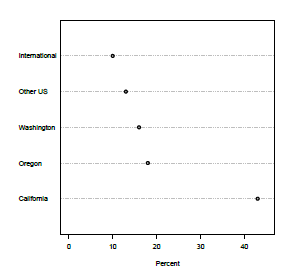
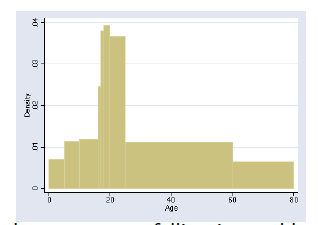
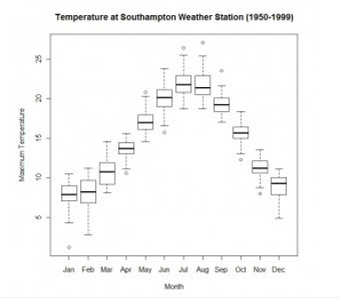
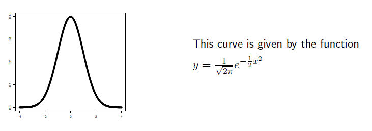
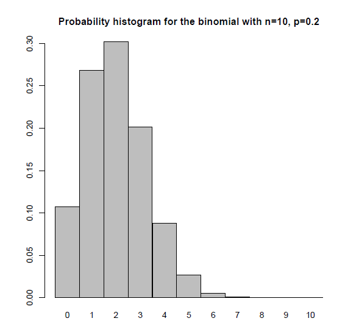

# Statistics Notes
Notes from course [Intro to Statistics by Stanford](https://www.coursera.org/learn/stanford-statistics). All material from the course is in OneDrive folder "Stanford-Statistics-Course-Slides".

**TODO:** Failed quiz of [Module 3](#probability) mainly due to Bayes' Formula wrong answer - try it again.

## Descriptive Statistics
Purpose:
- Communicate info
- Support reasoning

### Data Visualization
Discrete Data:
- Pie Chart & Bar Graph (discrete data frequencies), Scatter Plot (for 2D data)
- Dot Plot: bar graph put on its side (Y,X <- classes, frequencies) with dots instead of bars:

- Variable Width Histogram: $BarArea = Frequency$  (relative frequency can also be used)
    - Bar width = size of range (all bars have different sized ranges)
    - $BarHeight = Density = Frequency / BarWidth$

- Boxplot / Box-and-Whisker Plot: shows (in order): min, 25% percentile (1st quartile), median, 75% percentile (3rd quartile), max

Boxplots are compact so allow easily comparing multiple datasets - eg. boxplots of weather for multiple days:

**Data Visualization Pitfalls**: Many sophisticated plots can look visually appealing but be misleading & make data hard to interpret - eg. a 3D perspective bar graph where 3D volume of bars is shown but in fact volume isn't relevant at all (only bar's height is), and also 0 of each bar is at a different level making the plot hard to understand.

### Numerical Measures
- In a symmetric histogram, Mean = Median. But when histogram is very skewed, Median is preferred (Mean is much smaller or larger than Median).
- **Interquartile Range** measures how spread the data is: *3rd quartile (25% percentile) - 1st quartile (75% percentile)*
- Mean, Std. Deviation are both sensitive to a few small / large outliers. If that's a concern, use Interquartile Range instead.

## Producing Data and Sampling
While making a sample (to make inferences about population based on sample), avoid biases:
- *Selection Bias*: Sample of Convinience - eg. sample of people from hometown is a poor representative of whole country
- *Non-Response Bias*: parents less likely to respond to surveys at 6pm because busy with children
- *Voluntary-Response Bias*: people with very good or very bad experiences are much more likely to leave reviews.

Sampling Designs:
- *Simple Random Sample*: Random without Replacement
- *Stratified Random Sample*: Divide population into strata (eg. based on income), then draw from each using simple random.

$$Estimate = Actual + Bias + Chance/Sample Error$$
where:
- Chance/Sample Error gets smaller as sample size increases. Changing sample changes this error value.
- But bias isn't eliminated by increasing sample size.

An *Observational Study* may find a correlation between 2 things, but to estabilish causation a **Randomized Control Experiment** needs to be done:
- *Control* group gets placebo, *Treatment* group gets actual treatment - the groups should be otherwise identical.
- *Double-Blind experiment*: Neither subjects nor evaluators should know who is in which group.

## Probability
If A and B are mutually exclusive events, then:
- P(A or B) = P(A) + P(B)
- P(A and B) = P(A) P(B)

Conditional Probability: $P(B|A) = \frac{P(A and B)}{P(A)}$

Bayes' Rule: $P(B|A) = \frac{P(A|B) P(B)}{P(A)} = \frac{P(A|B) P(B)}{P(A|B) P(B) + P(A|~B) P(~B)}$

## Normal Approximation for Data & Binomial Distribution
*Three Sigma Rule*: In Normal Distribution:
- 68% (about 2/3) data falls within one standard deviation from mean
- 95% in 2 standard deviations
- 99.7% in 3 standard deviations

**Z-Score / Standardized Value**: Using $\bar{x}$ as Mean, $s$ as Standard Deviation:
$$z1 = \frac{x1 - \bar{x}}{s}$$ 

Z Score has no units. $z = 2$ means x is 2 standard deviations above average. $z = -3$ means x is 3 standard deviations below average. *Y axis (frequency count) has no role in calculating Z Score*.

This standard value forms a **Standard Normal Curve** with mean 0, variance 1:

### Normal Approximation
Estimating area under an approx normal curve.

A [*Z Table / Normal Table*](https://z-table.com/) tells the *percentile area* to the left of a Z Score.

To find area between points $x1$ and $x2$ on a normal curve:
- Calc Z Scores: $z1 = \frac{x1 - \bar{x}}{s}$, $z2 = \frac{x2 - \bar{x2}}{s}$
- Lookup percentile values for these Z Scores using Z Table: $p1$ % and $p2$ %.
- Find *percentile area*: $(p2-p1)$ %.

*X (given percentile)*: $x1 = \bar{x} + z1 \times s$

### Binomial Probability
Binomial Probability is ${}^n \mathrm{ C }_k p^k (1-p)^{n-k}$ where $p$ is the probability of success and $n$ is the no. of independant experiments. 

Binomial Coefficient is: ${}^n \mathrm{ C }_k = \frac{n!}{k! (n-k)!}$

The no. of successes $X$ is a **Random Variable** and has the Binomial Distribution. Probabilities of various $X$ can be visualized with a **Probabilistic Histogram**:

As $n \to \inf$, the binomial probability distribution approaches normal distribution. We can use this to approximate Binomial Probability of at most $x$ successes with [Normal Approximation](#normal-approximation) using approx mean $\bar{x} = np$, std. dev. $s = \sqrt{np(1-p)}$.

**Example**: If p = P(win a small prize) = 0.2, we play n = 50 times. What is P(at most 12 small prizes) ?
- Mean $\bar{x} = np = 50 \times 0.2 = 10$
- Std. Dev. $s = \sqrt{np(1-p)} = \sqrt{50 \times 0.2 \times (1-0.2)} = \sqrt{8} \approx 2.8$
- Z Score $z = \frac{x - \bar{x}}{s} = \frac{12 - 10}{2.8} \approx 0.71$
- P(at most 12 small prizes) = 0.7611 (by looking up 0.71 in [Z Table](https://z-table.com/))

**Simple Random Sample**: Sampling Without Replacement: It's not same as Binomial Probability because probability $p$ changes after each experiment. But if $n >> k$, then we can approximate it as Binomial Probability (& therefore Normal Distribution).

