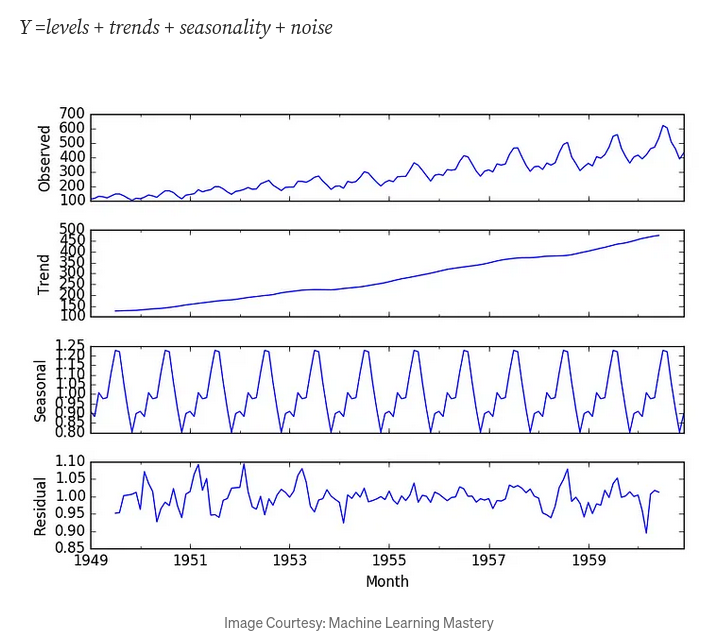

# Book: Intro to Time Series Forecasting with Python

In normal ML datasets, time of each past observation isn't critical - generally all past data is treated equally (or maybe some slight role like taking past 1 year data instead of all data). OTOH in time series, time is explicitly part of dataset, and time order dependence plays a critical role.

Time Series is a series of observations sequentially in time. Current time is $t$, observation at current time is $obs(t)$. Prior/lag times are $t-n$, future times (for forecasting observations) are $t+n$.

**Time Series Analysis** seeks to describe the available time series in terms of trends, seasonality, etc. It's not required for forecasting - in **Time Series Forecasting** we seek to predict/extrapolate future values of time series. These 2 goals are different - eg. in forecasting,
accuracy of future predictions is paramount, but it often comes at expense of explainability of _why_ a particular value was predicted.

In [Time Series Analysis](https://medium.com/swlh/time-series-analysis-7006ea1c3326), *observations together in time tend to be correlated*. We decompose time series into these parts:

- _Level_: Base value for the series, if it were a straight line.
- _Trend_: (optinal) often linear increase / decrease in values over time.
- _Seasonality_: (optional) repeating patterns / cycles of behaviours over time.
- _Noise_: part of time series that can't be explained by model.

### Time Series Forecasting
- More available data is usually better.
- Predictions for shorter time horizons are often easier to make with high confidence than medium or long term.
- Forecasts will be more accurate if they can be updated with new (future) observations, instead of just predicting once.
- At what temporal frequency is forecast required? Accordingly down-sampling or up-sampling of data may be required.

Forecasting is a *supervised learning* problem: given observations of past times, predict next observation. It's similar to autoregressively predicting next word in LLMs. This is called **Sliding Window Method** - number of past observations used is called *window width* or *size of lag*. 

It can also be used on *Multivariate Time Series* (time series with multiple observation columns for each time). Some ML methods have issues with this (predicting multiple output vars accurately), but deep learning (neural networks) can do it easily. We can also do *Multi-Step Forecasting* - predicting multiple future values at once instead of just once.

We use ML for time series forecasting when classical methods fail.

### Window Types
- *Sliding Window* (also called Lagged data): `df.shift(1)` is data of $t-1$ and so on. We can pick a window width $N$ and create columns of $t$, $t-1$, ..., $t-N$. For deciding best window width, we can do **sensitivity analysis** - pick different widths with different dataset *views*, pick the one which performs best.
- *Rolling Window*: summary of values at previous time steps - eg. rolling mean (window size = 2): $avg(t-1, t)$. `df.rolling()` does this.
- *Expanding Window*: includes list of all previous data at each time step. `df.expanding()` does this.
