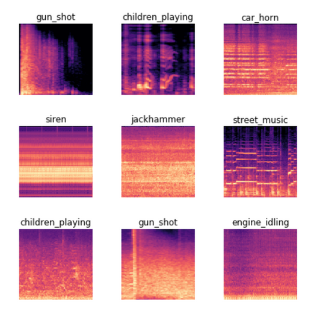

# [Chapter 1](https://colab.research.google.com/github/fastai/fastbook/blob/master/01_intro.ipynb)

(To be run with GPU) Download image dataset and fine tune a vision model using the dataset:
```python
from fastai.vision.all import *
path = untar_data(URLs.PETS)/'images'

def is_cat(x): return x[0].isupper()
# from_name_func() means the label_func (is_cat) is applied to each image name to find its class
dls = ImageDataLoaders.from_name_func(
    path, get_image_files(path), valid_pct=0.2, seed=42,
    label_func=is_cat, item_tfms=Resize(224))

# use CNN (Convolutional Neural Network) architecture
# here pretrained=True, so base model pretrained on ImageNet dataset is used.
learn = vision_learner(dls, resnet34, metrics=error_rate)

# NOTE: we used .fine_tune() and NOT .fit() 
# because we only want to train the head (extra layers added on top of pretrained base model)
# .fit() would have modified weights of even pretrained layers, but we don't want to throw away their info
learn.fine_tune(1)         # 1 is no. of training epochs

# Model Prediction
# is_cat,_,probs = learn.predict(img)       # img is a Pillow image
```

A `Transform` is code that's automatically applied to data during training. 
Here we used item-wise transformation `Resize(224)` to resize each image to 224x224 pixels before using it for training / validation. 224 here is because older models accepted exactly this image size, but newer models can work with larger sizes and hence pick up more accurate details. Batch transforms can also be used.

**`valid_pct=0.2` means 20% of data is seperated into validation set, rest 80% used for training.**

`vision_learner` means use a **Convolutional Neural Network (CNN)** with ResNet architecture (34 indicates no. of layers in it) and metric `error_rate` (what % of validation images wrongly classified - `1 - accuracy`).

*Difference b/w Metric and Loss*: Loss function is chosen so that Stochastic Gradient Descent (SGD) can easily use it to figure out how much it should nudge model weights. OTOH Metric is for human consumption.

Here pretrained CNN (trained on ImageNet dataset) is fine-tuned. When using a pretrained model, `vision_learner` will *remove the last layer, since that is always specifically customized to the original training task* (i.e. ImageNet dataset classification), and replace it with one or more new layers with randomized weights, of an appropriate size for the dataset you are working with. This last part of the model is known as the **head**. Using a pretrained model for a task different to what it was originally trained for is known as **transfer learning** - that's what we have done here.

**Image Segmentation** means for each pixel, identifying what type of object it's part of - it's half-way to Object Detection.

**TODO:** Lookup what is ResNet (popular CNN architecture).

## CNN on non-Image inputs
In section titled "Image Recognizers Can Tackle Non-Image Tasks" of this chapter's notebook, examples are given
of how non-image inputs can be treated as images and then processed with CNN networks.

Sound can be converted to a spectogram, which is a chart showing amount of each frequency at each time in an audio:



Time Series can be converted to an image simply by plotting on a graph, however it's a better idea to represent data in a way that emphasizes important elements (anamolies and seasonalities for time series). Various transforms are available for time series data.

More examples of applications are in mouse click behaviour analysis, malware analysis, etc.

**A good rule of thumb for converting a dataset into an image representation: if the human eye can recognize categories from the images, then a deep learning model should be able to do so too.**

## Tabular data
**In general, pretrained models are not widely available for any tabular modeling tasks**, although some organizations have created them for internal use. So `.fit_one_cycle()` is used to train from scratch.

**TODO:** Go over questions at the end of chapter again!