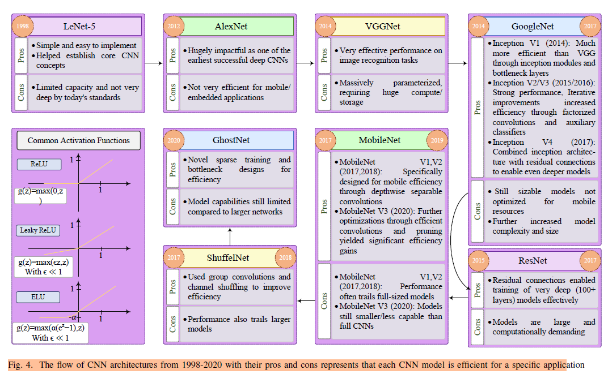
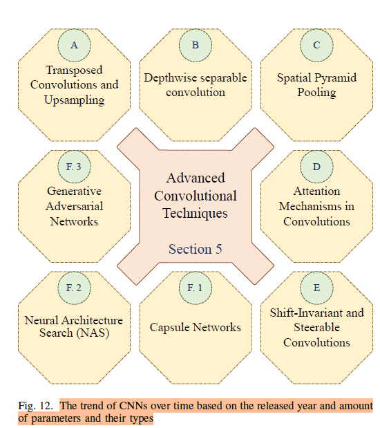

# CNN Architectures & Overview
Notes on research paper: [A Comprehensive Survey of Convolutions in Deep Learning: Applications, Challenges, and Future Trends](https://arxiv.org/abs/2402.15490)

Applications (**TODO**: lookup all these): 6D vision, generative (GAN using CNNs for generator & discriminator), meta-learning, denoising, super-resolution, texture synthesis

For running CNNs on resource-constrained devices, 2 approaches:
- *Lightweight CNN architectures*: eg. MobileNet family trained specifically for running on mobiles, achieved SOTA accuracy in various image classification tasks.
- *Compressing CNNs*: Techniques (pruning, quantization, distillation; **TODO**: lookup these) for reducing model size & consequently diminish volume of data transfer b/w devices. eg. **Tensorflow Lite** framework has various compression techniques.

Convolution properties:
- *Localization*: capture local patterns and spatial info in data; useful for image recognition, as objects can be identified based on local structures
- *Parameter Sharing*: significant reduction in no. of trainable params
- *Shift-Invariant*: recognize objects irrespective of position or orientation; filters detect features at various spatial scales, *encapsulate both local & global info*

Convolutions were originally used in signal processing (*wavelets* = frequency domain analysis). At each position of sliding kernel, convolution does element-wise multiplication with input. *Multi-resolution decomposition* property of wavelets means we can decompose a signal into coarse (low-frequency) and details (high-frequency). CNN filters in each level act like wavelets. *Adapted Wavelet Bases* means CNN can learn patterns at both coarse level (initial layers) and detailed (later CNN layers).

Pooling (reduces spatial resolution) advantages:
- effectively reduces no. of params
- *translational invariance*: minor spatial movement of object in image doesn't matter
- (placed at end) reduces risk of overfitting

Batch Normalization (normalizing layer outputs, normalize inputs for each mini-batch during training):
- reduces internal covariate shift (**TODO**: what does that mean?)
- smoother optimization & more aggressive learning rates, leading to faster convergence
- better model generalization; regularization (reduces need for dropout)

Upsampling also called transposed convolution, de-convolution, fractionally stridden convolution.

## Types of CNNs
By dimensions: 
- 1D sequential data (NLP: text classification, sentiment analysis; audio: SR, music analysis, speaker identification, emotion recognition)
- 2D (images)
- 3D volumetric (3D medical images (eg. tumour segmentation), video data, analyze point cloud data (discrete) via vexelization (i.e. first convert to continous 3D data))

Types:
- **Dilated/Atrous Convolutions** are a variant of convolution that introduces gaps (dilation) between kernel elements. This gap allows for an increased receptive field (area of image filter can see at once) without increasing no. of params, improving computation efficiency. Exapple application: sematic segmentation.
- *Grouped Convolution*: Group input & output channels. Within each group, seperate convolutions performed, then concat to final output. Reduced computational cost & memory consumption, improved memory parallelism. Eg. use in large-scale CNN like ResNet.
- Attention: self-attention (originally of transformers) applied to CNN, leading to *vision transformers* (they segment image into patches, seperately extract features from each patch)
- Depthwise
- NAS (Neural Architecture Search): search for diff CNN architectures (kernel sizes, depths, connectivity patterns) automatically, found some SOTA architectures. Eg application: self-autonomous vehicle navigation (specifically tailored to data collected by vehicle sensors)

## CNN Architectures
Some famous CNN architectures (with pros & cons):

- Inception net introduced convolution blocks with multiple filter sizes to capture features at various scales.
- DenseNet connected each layer to each subsequent layer for max info flow, feature reuse. Reduced params.
- MobileNet - depth-wise seperable convolutions
- EfficientNet

- Capsule Networks use capsules (groups of neurons representing parts of entity like pose, defamation, parts).

Advanced Convolutional Techniques:

- *Spatial Pyramid Pooling* allows handling inputs of various sizes & aspect ratios. Divides input feature maps into diff regions & applies pooling to each. Pooled results concated to form fixed-size 1D input for subsequent fully-connected layers.

## Terms to lookup
- Elu activation: where is it used?
- CNN compression: quantization, distillation
- CNN filters vs wavelets diff??
- ShuffelNet: group convolution & channel shuffling
- Multi-Stage Optimization
- Applications: Embedded Vision, 6D Vision, generative, meta-learning, super-resolution, texture synthesis
- Spatial Pyramid Pooling

