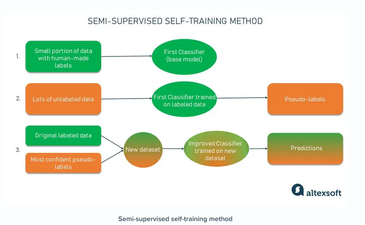
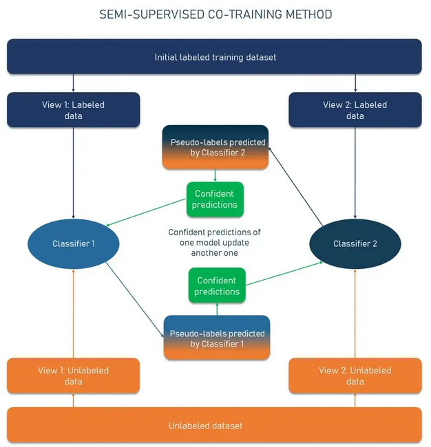

# Semi-Supervised Learning
It combines both supervised and unsupervised learning. Typically used when a small part of the data is labelled and rest is unlabelled.
Eg. in Fraud Detection, out of a large amount of data some might be labelled as fraud / not-fraud, while rest is unlabelled. 
Then semi-supervised learning can be used to use all the data for model training.

[`sklearn.semi_supervised`](https://scikit-learn.org/stable/modules/semi_supervised.html) implements semi-supervised learning.

## Self-Training
This technique converts a supervised algo to semi-supervised:
- First train a supervised model on the small portion of data that's labelled - this is the base model.
- Using base model, predict *pseudo-labels* for remaining unlabelled data.
- Pick the pseudo-labels having high confidence and merge labels with original labelled dataset. Retrain model.
- Repeat as many times as necessary (say, 10 times).

## Co-Training
It's an improvement on self-training. Our dataset has 2 independent sets of features that are both by themselves sufficient to predict the target.
So we train 2 models on labelled data, one for each independent sets of features. 
In loop, predict pseudo-labels with one model and use it to improve second model.

